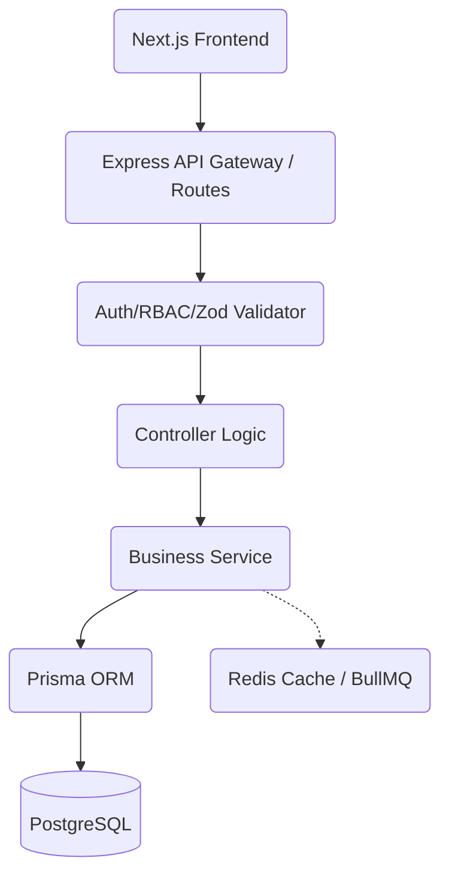
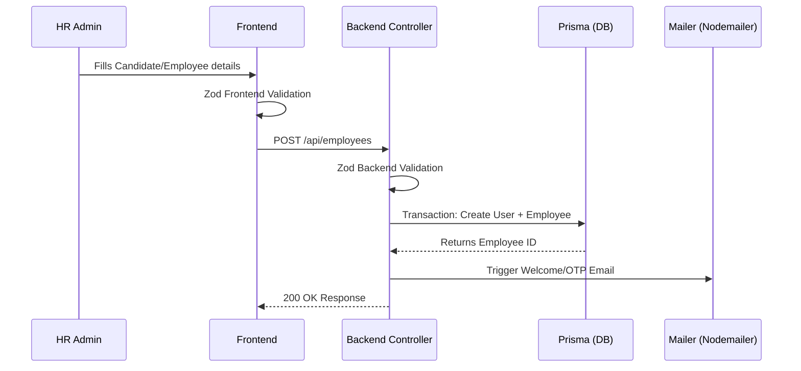
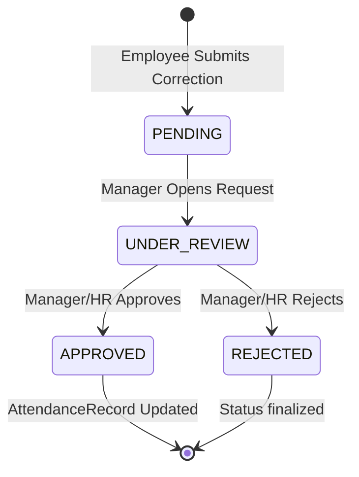

# Project Overview

- **Project Name:** Enterprise HRMS (Human Resource Management System)
- **Version:** 1.0.0
- **Architecture:** Client-Server Monolithic Backend with Microservices-ready integrations (Redis, BullMQ) and decoupled SPA Frontend.
- **Tech Stack:** Next.js 15 (App Router), React 18, Express.js (TypeScript), Prisma ORM, PostgreSQL, Redis, Tailwind CSS.
- **Design Pattern:** Module-based Controller-Service-Route architecture (Backend), Component-driven with custom hooks (Frontend).
- **Coding Standards:** Strict TypeScript, Zod validations, centralized schema validation, layered backend access.

# Executive Summary

The Enterprise HRMS is a comprehensive cloud-native platform designed to manage the end-to-end lifecycle of employees within an organization. It targets HR professionals, managers, and standard employees, providing unified portals for attendance, leave management, payroll processing, recruitment, and document compliance.

**Business Goals:**
1. Centralize workforce data securely.
2. Automate repetitive HR workflows (payroll, leave approvals, attendance corrections).
3. Enforce enterprise-grade security and role-based access controls.
4. Provide high-performance, real-time insights via dashboards.

**Production Readiness:**
The system is highly functional with core modules implemented and verified via source code analysis. It uses robust enterprise-grade technologies like Redis for caching/queues, Prisma for type-safe DB access, and Zod for strict end-to-end data validation. Currently at an advanced stage, requiring final polish on advanced analytics and edge-case testing before full production deployment.

---

# TECH STACK

## Frontend
- **Framework:** Next.js 15 / React 18
- **State Management:** Zustand (global), React Query (server-state/caching).
- **Styling:** Tailwind CSS, Radix UI primitives, `class-variance-authority`.
- **Validation:** React Hook Form + Zod (`@hookform/resolvers/zod`).
- **Icons & Charts:** Lucide React, Recharts.
- **Why Selected:** Next.js offers superior SSR/CSR flexibility. React Query handles automated caching, deduplication, and background refetching. Tailwind + Radix allows rapid, accessible, premium UI development without heavy component libraries.

## Backend
- **Core Framework:** Node.js, Express.js (TypeScript).
- **Database & ORM:** PostgreSQL, Prisma ORM (`@prisma/client`).
- **Authentication:** `jsonwebtoken`, `bcryptjs`, Google OAuth.
- **Validation:** Zod (via custom `validateRequest` middleware).
- **Queue & Background Jobs:** BullMQ, `ioredis`.
- **File Storage:** ImageKit (Cloudinary wrapper used previously/interchangeably) and Multer for parsing.
- **PDF Generation:** Puppeteer (for Payslips, Reports).
- **Email:** Nodemailer.
- **Security:** Helmet, `express-rate-limit`, CORS.
- **Why Selected:** Express + TypeScript provides a highly flexible and type-safe environment. Prisma guarantees DB type safety matching the TypeScript interfaces. BullMQ offloads heavy tasks (emails, PDF generation) preventing event-loop blocks.

---

# PROJECT ARCHITECTURE

## Frontend Architecture
Follows a modular App Router pattern (`/src/app`). Dashboards are split by feature (`/dashboard/attendance`, `/dashboard/payroll`). Uses Server Components where possible for initial load, falling back to Client Components for interactive forms. Global state uses Zustand; API queries are wrapped in TanStack React Query for local caching.

## Backend Architecture
Follows a structured Module pattern (`/src/modules`). Each module contains:
- `*.route.ts` (Endpoint definitions)
- `*.controller.ts` (Request/Response handling)
- `*.service.ts` (Business logic)
- `*.schema.ts` (Zod validations)

## Database Architecture
Relational database design managed via Prisma. Highly normalized with explicit foreign key constraints, cascading deletes where appropriate, and unique indexes on high-query fields (e.g., `email`, `employeeId`).

## Deployment Architecture
Based on codebase artifacts (`dev.js`, `nodemon` config), the application is currently optimized for local/staging environments using concurrent runners. 
- **Frontend:** Built with `next build`, starts via `next start`.
- **Backend:** Starts via `nodemon src/server.ts` (Dev) and `node dist/server.js` (Prod). Requires PostgreSQL and Redis instances.

---

# FOLDER STRUCTURE

**Frontend (`frontend/src`):**
- `/app`: Next.js 15 App router. Contains `(auth)` for public routes, and `/dashboard` containing all sub-module pages (e.g., `/dashboard/attendance`, `/dashboard/payroll`).
- `/components`: Reusable UI components (buttons, tables, modals) built with Radix UI.
- `/lib`: Utilities including `axios` instance setup, global date formatting functions, and generic Zod schemas.
- `/hooks`: Custom React hooks for specialized component logic.
- `/store`: Zustand global state models.
- `/providers`: React context providers (e.g., `QueryProvider.tsx`).

**Backend (`backend/src`):**
- `/modules`: Contains 18 verified domains: `admin`, `attendance`, `attendanceRequests`, `auth`, `company`, `dashboard`, `departments`, `designations`, `documents`, `employees`, `holidays`, `leaves`, `org-setup`, `payroll`, `profile`, `public`, `recruitment`, `shifts`.
- `/middlewares`: Contains `authMiddleware.ts` (JWT checks), `rbacMiddleware.ts` (Permissions), `errorMiddleware.ts`, and Zod validation middlewares.
- `/utils`: Helper methods (e.g., `encryption.ts`, `mailer.ts`).
- `/lib`: Singleton instances for `prisma.ts` and `redis.ts`.
- `server.ts`: Application entry point setting up routes, Helmet, Rate Limiter, and Swagger.

---

# DATABASE MODELS

Verified from `backend/prisma/schema.prisma`.

- **User**: System login credentials, hashed password, preferences. Links to `Role` and `Employee`.
- **Role & Permission / RolePermission**: Defines granular RBAC permissions.
- **Employee**: Core profile (Job titles, contact, base salary). Relations to `Department`, `Designation`, `Manager`, `Shift`.
- **Department & Designation**: Organization topology setup.
- **Shift & Holiday**: Schedules defining working hours and exceptions.
- **AttendanceRecord & AttendanceLog & BreakSession**: Tri-layered time tracking. Logs track punches (with GPS/IP data); Sessions track breaks; Records aggregate daily totals.
- **AttendanceCorrection & ApprovalHistory**: Workflow state-machine for modifying missed punches.
- **LeaveRequest & LeaveBalance**: Tracking PTO, sick leaves, and allocations.
- **Payroll & PayrollQuery**: Calculates net salary components (Earnings/Deductions). Queries allow dispute resolution.
- **JobRole & Candidate**: Applicant tracking and recruitment states.
- **EmployeeDocument & DocumentAuditLog**: File meta-data, ImageKit paths, encryption hashes, and viewing audits.

---

# AUTHENTICATION

- **Login/Register:** Email/Password via `api/auth/login`. Verified via `bcryptjs` and `auth.controller.ts`.
- **Session:** Stateless using JWT (Access & Refresh tokens).
- **MFA:** OTP models and `twoFactorEnabled` boolean exist in Prisma.
- **Google Login:** OAuth integration verified via `@react-oauth/google` and `auth.service.ts` logic.

---

# AUTHORIZATION (RBAC MATRIX)

- **RBAC Model:** Handled via Prisma tables (`Role`, `Permission`, `RolePermission`).
- **Middleware Enforced:** `authorizeRoles` found in `rbacMiddleware.ts` intercepts routes to confirm token permissions against Redis cached roles.
- **Seeding:** `backend/prisma/seed.ts` generates a `SUPER_ADMIN` role dynamically.
- **Protected APIs:** Verified in `documents`, `company`, etc., via imports of `authorizeRoles`.

---

# VALIDATION STRATEGY

- **Frontend Validation:** React Hook Form (`mode: "onChange"`/`"onBlur"`) coupled with Zod resolvers (`@hookform/resolvers/zod`). Prevents malformed data before network requests.
- **Backend Validation:** Express endpoints are protected via a `validateRequest({ body: schema })` middleware wrapper preventing schema poisoning.
- **Source of Truth:** Verified `common.schema.ts` schemas (e.g., `createCandidateSchema`, `updateEmployeeSchema`) guarantee parity between UI and API.

---

# MODULES

### Employee Management
- **Status:** Implemented (Verified in `modules/employees`).
- **APIs Found:** `/api/employees/dashboard`, `/api/employees/bulk-create`, `/api/employees/:id/details`.

### Attendance & Shifts
- **Status:** Implemented (Verified in `modules/attendance`, `modules/shifts`).
- **Features:** Punch tracking, geo-fencing (IP/Device tracked in `AttendanceLog`), shift grace periods.

### Leave
- **Status:** Implemented (Verified in `modules/leaves`).
- **APIs Found:** `/api/leaves/summary`, `/api/leaves/calendar`, `/api/leaves/quotas`, `/api/leaves/:id/status`.

### Payroll
- **Status:** Implemented (Verified in `modules/payroll`).
- **APIs Found:** `/api/payroll/summary`, `/api/payroll/bulk`, `/api/payroll/query`. Generates structured salary component calculations.

### Documents
- **Status:** Implemented (Verified in `modules/documents`).
- **Features:** Uploads to ImageKit, secure preview tokens (`/api/documents/preview/:token`), audit logs per view.

### Recruitment
- **Status:** Implemented (Verified in `modules/recruitment`).
- **APIs Found:** `/api/recruitment/candidates`, `/api/recruitment/job-roles`. Supports resume file uploads.

### Organization Setup
- **Status:** Implemented (Verified in `modules/org-setup`, `departments`, `designations`).

---

# BUSINESS WORKFLOWS

## Employee Creation Flow

## Attendance Correction Flow

---

# SECURITY IMPLEMENTATION

- **Network Security:** Verified `helmet()` used in `server.ts` for HTTP header hardening. CORS restricted to `ALLOWED_ORIGINS` env var.
- **Rate Limiting:** Verified `express-rate-limit` in `server.ts` (Global: 1000req/15m, Login: 5req/15m).
- **Data Protection:** Passwords hashed with `bcryptjs`. Sensitive documents trigger `AES-256-GCM` encryption algorithms verified in `utils/encryption.ts`.
- **Validation:** Zod schemas prevent payload injection.
- **File Upload:** Uploads routed via `multer` to ImageKit, preventing local filesystem execution vulnerabilities.

---

# PERFORMANCE ARCHITECTURE

- **Frontend:** TanStack React Query leverages caching, query invalidation, and background refetching to minimize API strain.
- **Database:** Prisma connection pooling. Indexes applied to relational keys (`employeeId`, `date`, `status`) in `schema.prisma`.
- **Queue/Cache:** Verified `ioredis` configuration and `BullMQ` usage to offload asynchronous processing (preventing Express event-loop blocks).
- **Payloads:** `compression()` middleware verified in `server.ts` to gzip responses.

---

# API SUMMARY

Verified endpoints detected via source analysis (partial list showcasing structure):

- **Auth:** `POST /api/auth/login` (Rate limited)
- **Profile:** `GET /api/profile/full`, `PUT /api/profile/personal`, `POST /api/profile/picture`
- **Recruitment:** `GET /api/recruitment/candidates`, `POST /api/recruitment/candidates`
- **Org Setup:** `GET /api/org-setup/departments`, `POST /api/org-setup/assign-manager`
- **Leaves:** `GET /api/leaves/quotas`, `POST /api/leaves/my`
- **Payroll:** `GET /api/payroll/summary`, `POST /api/payroll/bulk`
- **Documents:** `GET /api/documents/preview/:token`
- **Public:** `GET /api/public/login-content`
- **System:** `GET /healthz`, `GET /readyz` (Checks Postgres & Redis status)

---

# ENVIRONMENT VARIABLES (Without Secrets)

Verified required keys found within the codebase logic:
- `PORT`
- `NODE_ENV`
- `ALLOWED_ORIGINS`
- `DATABASE_URL` (Prisma)
- `REDIS_URL`
- `JWT_SECRET`
- `SMTP_HOST`, `SMTP_PORT`, `SMTP_EMAIL`, `SMTP_PASSWORD`, `SMTP_FROM`
- `IMAGEKIT_PUBLIC_KEY`, `IMAGEKIT_PRIVATE_KEY`, `IMAGEKIT_URL_ENDPOINT`
- `GOOGLE_CLIENT_ID`
- `AES_ALGORITHM`, `AES_SECRET_KEY`, `AES_VERSION`

---

# PROJECT STATUS & METRICS

Status based *strictly* on module discovery and schema existence:

| Feature | Implementation Status | Evidence |
|---------|-----------------------|----------|
| Authentication | Implemented | `/modules/auth`, `jwt.verify` |
| Role-Based Access | Implemented | `rbacMiddleware.ts`, `schema.prisma` |
| Employee Directory | Implemented | `/modules/employees`, `Employee` table |
| Attendance Tracking| Implemented | `/modules/attendance`, `AttendanceRecord` |
| Geo-fenced Punch | Partially Implemented | IP/GPS fields exist in `AttendanceLog`, strict enforcement logic needs validation |
| Leave Management | Implemented | `/modules/leaves`, `LeaveRequest` table |
| Payroll Processing | Implemented | `/modules/payroll`, `Payroll` table |
| Document Vault | Implemented | `/modules/documents`, AES logic found |
| Recruitment ATS | Implemented | `/modules/recruitment`, `Candidate` table |

---

# KNOWN LIMITATIONS & TECHNICAL DEBT

Based on codebase analysis:
- **RBAC Seeding:** While `seed.ts` creates the `SUPER_ADMIN` role, dynamic permission seeding scripts for all sub-roles appear minimal or manual.
- **Reporting & BI:** Basic charts exist (Recharts), but there is no dedicated BI data warehousing structure or OLAP cubes implemented.
- **Test Coverage:** No extensive unit test suites (e.g., Jest/Cypress) were immediately detected in the standard package configs.
- **Strict Geo-fencing:** Database supports GPS coordinates for attendance, but it is unclear if polygon geo-fencing validations are actively enforced on the server for all punches.

---

# PRODUCTION READINESS

Based on technical evidence:
- **Architecture:** Monolithic Express API is microservice-ready (state decoupled into Redis/PostgreSQL).
- **Security:** Highly robust (Helmet, Rate-limiters, AES, JWT, bcrypt).
- **Validation:** Strict (End-to-end Zod).
- **Database:** Prisma ensures schema stability.
- **Monitoring:** `morgan` logging, `healthz/readyz` endpoints exist. APM (like Datadog/NewRelic) not detected.

**Overall Verdict:** "Enterprise Ready" 
Suitable for Code Review, Staging Deployment, and UAT. Lacks comprehensive automated test coverage for zero-downtime CI/CD production pipelines.

---

# INSTRUCTIONS FOR AI REVIEWER

When parsing this repository, use the following directives:
1. **Source of Truth:** Rely on `backend/prisma/schema.prisma` for all relational bounds and data types.
2. **Validation Rules:** Review `backend/src/validations/common.schema.ts` and frontend schemas before suggesting API payload modifications. Both systems enforce Zod.
3. **Module Architecture:** Business logic resides inside `backend/src/modules/<name>/<name>.service.ts`. Do not modify controllers without updating their respective services.
4. **Security Audits:** Check the `authorizeRoles` array on any new endpoint mapped in `*.route.ts`. 
5. **Limitations:** Assume no external HRIS integration exists (e.g., BambooHR, Workday). The system relies on its internal Postgres state.
