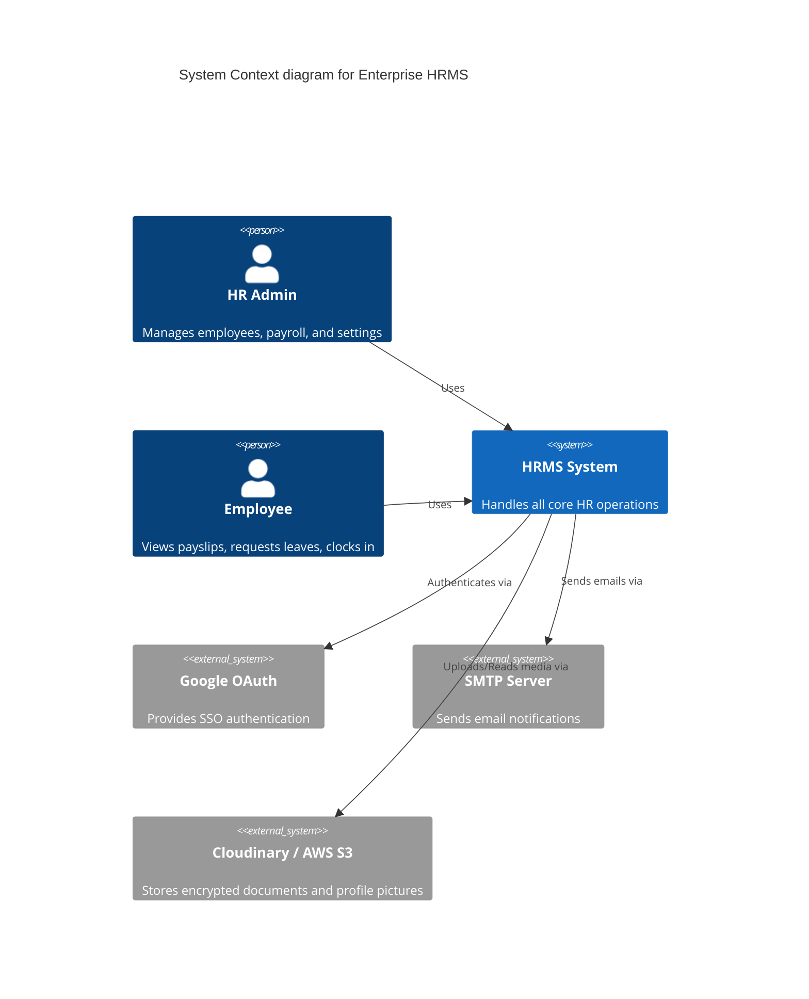

# HRMS Architecture Document

This document outlines the high-level architecture of the Enterprise HRMS system.

## 1. System Context Diagram

## 2. Component Architecture

### Frontend (Next.js App Router)
- **Server Components:** Used for static content, initial data fetching, and SEO optimization.
- **Client Components:** Used for interactive UI (forms, dashboards, charts) driven by Zustand and React Query.
- **Routing:** Feature-based routing within `src/app`.

### Backend (Express + TypeScript)
- **API Gateway/Routing:** `server.ts` maps to feature modules.
- **Controllers:** Handle HTTP requests and responses. No business logic.
- **Services:** Contain 100% of the business logic.
- **Data Access:** Prisma ORM handles all PostgreSQL interactions.

## 3. Security Architecture
- **Authentication:** Dual-layer JWT (Access + Refresh tokens). Passwords hashed using bcrypt (cost 10+).
- **Authorization:** Module/Action based RBAC (`rbacMiddleware`).
- **Data Protection:** PII is isolated. Sensitive documents are encrypted at rest.

## 4. Database Strategy
- **Relational Model:** PostgreSQL for strict ACID compliance.
- **Transactions:** Complex operations (e.g., Payroll generation) are wrapped in `$transaction`.
- **Soft Deletes:** Enforced via `deletedAt` for critical tables (e.g., Employees, Invoices).
