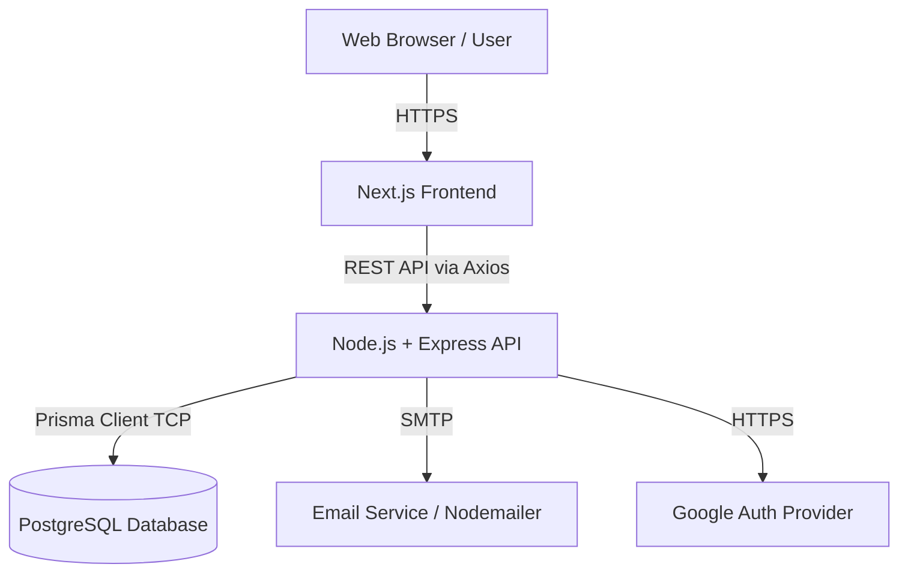

# 01 Project Architecture

## 1. Introduction
This document explains the overarching system architecture of the Enterprise HRMS platform.

## 2. Purpose
To visualize how the independent subsystems (Frontend, Backend, Database, Third-Party Services) communicate and why they were decoupled.

## 3. Problem it Solves
A monolithic architecture often leads to deployment bottlenecks and tightly coupled codebases. By adopting a decoupled Client-Server architecture, we isolate UI rendering concerns from business logic and database management.

## 4. Why This Architecture?
We chose a decoupled **N-Tier Architecture** (Frontend Server, Backend API Server, Database Server) rather than a monolith. 
- **Scalability:** Frontend (Next.js) can be deployed to Vercel/Netlify/CDN independently from the Backend (Express), which can be scaled in Docker containers on AWS/GCP.
- **Security:** The database is never exposed directly to the internet; it only talks to the secure Node.js API layer.

## 5. Folder Location
`docs/01_Project_Architecture.md`

## 6. Architecture Diagram

## 7. System Components

### 7.1 Frontend Layer
- **Tech:** Next.js, React, TailwindCSS.
- **Role:** Handles presentation, client-side routing, local state (Zustand), server state caching (React Query), and internationalization (i18next).

### 7.2 API Layer
- **Tech:** Node.js, Express, TypeScript.
- **Role:** Handles business logic, RBAC validation, JWT verification, request parsing (Zod), and rate limiting. It acts as the gatekeeper.

### 7.3 Data Access Layer (DAL)
- **Tech:** Prisma ORM.
- **Role:** Abstracts raw SQL queries into type-safe TypeScript methods. Handles migrations and schema syncing.

### 7.4 Database Layer
- **Tech:** PostgreSQL.
- **Role:** Persistent, relational storage. Enforces referential integrity (Foreign Keys, Cascades) and indexing.

## 8. Request Flow
1. User clicks "Login" on Frontend.
2. Next.js triggers an Axios POST request to `api.domain.com/api/auth/login`.
3. Express router routes the request to `auth.controller.ts`.
4. Controller uses Zod to validate the payload.
5. Controller calls `auth.service.ts` containing the business logic.
6. Service queries the database using Prisma.
7. Service compares hashed password using `bcrypt`.
8. Service generates a JWT and passes it back to the controller.
9. Controller sends a 200 HTTP response.
10. Frontend receives JWT, stores it, and redirects to `/dashboard`.

## 9. Real Company Example
Netflix and Uber use similar multi-tier architectures, but scale them out into Microservices. For an HRMS, a Modular Monolith (where the backend is one codebase but logically separated into modules like Auth, Leave, Payroll) is the enterprise standard, as it provides the benefits of microservices (clean boundaries) without the operational overhead.

## 10. Alternative Implementation
- **Microservices:** Splitting Payroll, Attendance, and Auth into separate servers. *Why rejected?* Too much DevOps overhead for the current scale.
- **Serverless (Next.js API Routes):** Putting backend inside Next.js. *Why rejected?* Heavy background tasks (like Payroll generation) and persistent WebSocket connections run better on a dedicated Node/Express server.

## 11. Interview Questions
**Q: Why separate the frontend and backend instead of using Next.js API routes for everything?**
*Answer:* Separation of concerns. A dedicated Express server is better suited for long-running processes, complex background cron jobs (e.g., monthly payroll generation), WebSocket handling, and allows building mobile apps in the future that consume the exact same API.

## 12. Manager Questions
**Q: How does this architecture handle a sudden spike in traffic during morning check-ins?**
*Answer:* Because the Node.js API is stateless (using JWT instead of memory sessions), we can spin up multiple instances of the Express server behind a Load Balancer (like AWS ALB or NGINX) to handle high concurrent Attendance punches.

## 13. Summary
Our decoupled N-tier architecture ensures that the HRMS is highly scalable, secure, and maintainable. The clear boundary between presentation, business logic, and data access is the foundation of our enterprise-grade platform.
