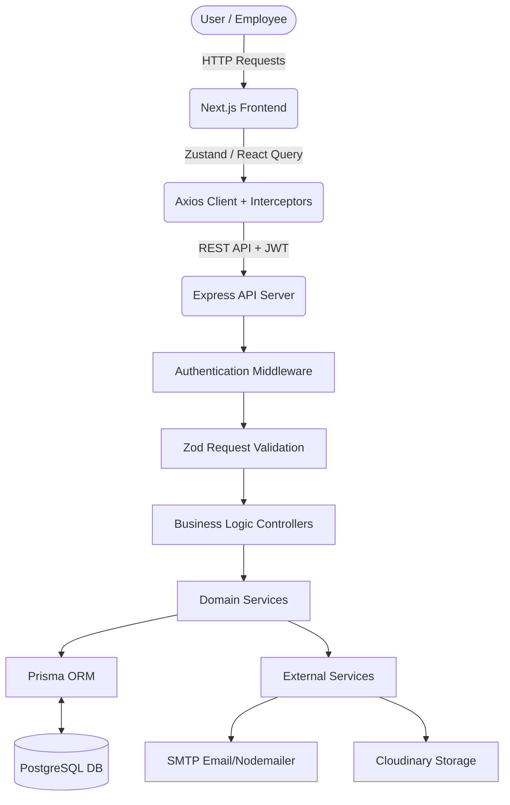

# 01. Enterprise HRMS - Project Overview

## Business Purpose
The Enterprise HRMS (Human Resource Management System) is a comprehensive, scalable, and secure platform designed to automate and streamline core HR operations for medium to large enterprises. It centralizes employee records, attendance tracking, leave management, document verification, payroll processing, and organizational structuring into a single, cohesive dashboard.

## Workflow Overview
The platform operates on a centralized architecture with distinct roles (Super Admin, HR Admin, Manager, Employee). 
1. **Onboarding**: Super Admin creates HR → HR creates Employees (or bulk imports).
2. **Daily Operations**: Employees check-in/out → Managers approve attendance corrections and leaves.
3. **Monthly Processing**: HR generates payroll based on effective working hours and approved leaves → System generates PDF payslips and emails them to employees.
4. **Self-Service**: Employees manage their profiles, upload compliance documents, and raise payroll queries.

## Technology Stack & Justification

### Frontend (Client-Side)
- **Next.js (React Framework)**: Used for App Router, server-side rendering (SSR), and SEO optimization.
- **Tailwind CSS**: Utility-first CSS framework for rapid UI development and ensuring a consistent enterprise design system.
- **shadcn/ui**: Accessible, customizable UI components (Radix UI) ensuring consistent typography and interactions.
- **Zustand**: Lightweight global state management for user sessions and theme toggling.
- **React Query (TanStack Query)**: Data fetching, caching, and state synchronization with the backend.
- **Axios**: Configurable HTTP client with interceptors for attaching JWT tokens and handling token refreshes.

### Backend (Server-Side)
- **Node.js & Express.js**: Fast, scalable, and event-driven runtime environment for building RESTful APIs.
- **Prisma ORM**: Type-safe database client ensuring schema consistency, easy migrations, and robust relational querying.
- **PostgreSQL**: Relational database chosen for strict ACID compliance, essential for payroll and financial data integrity.

### Security & Utilities
- **JSON Web Tokens (JWT)**: Stateless authentication mechanism.
- **bcryptjs**: Password hashing with automated salt generation.
- **Zod**: Schema declaration and runtime validation for all API inputs.
- **Nodemailer**: SMTP-based email dispatch for OTPs, payslips, and notifications.
- **Cloudinary / Multer**: For secure document and avatar uploads.
- **Puppeteer**: Headless Chrome node API for rendering highly formatted PDF payslips.
- **Swagger**: Auto-generated API documentation and testing interface.

## System Workflow Diagram

## Best Practices & Developer Notes
> [!NOTE]
> **Environment Variables**: Never hardcode secrets. Always use `.env` files for `DATABASE_URL`, `JWT_SECRET`, `CLOUDINARY_URL`, and SMTP credentials.
> **Type Safety**: The project strictly enforces TypeScript interfaces on the frontend and Prisma-generated types on the backend to prevent runtime errors.
> **Scalability**: The modular architecture allows swapping out components (e.g., changing Cloudinary to AWS S3) by simply updating the utility functions.
