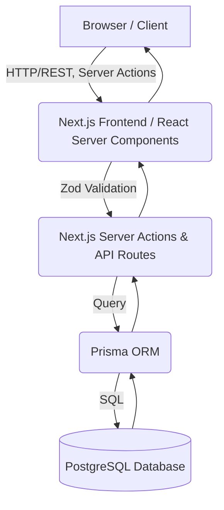

# 02 - System Architecture

## Architecture Diagram

## Complete Request Flow

### 1. Employee Login Flow
1. **User Input**: Employee enters credentials in the Shadcn UI login form.
2. **Validation**: React Hook Form and Zod validate the input format on the client.
3. **Action**: A NextAuth `signIn` action is triggered.
4. **Backend**: Auth.js checks the database via Prisma to verify the hashed password.
5. **Session**: A JWT token is generated and stored in a secure HttpOnly cookie.
6. **Redirect**: Employee is redirected to the `/employee/dashboard` page.

### 2. Attendance Flow
1. **User Action**: Employee clicks "Punch In" on the dashboard.
2. **Client**: Zustand updates optimistic UI state.
3. **Server Action**: Next.js Server Action `recordAttendance` is called.
4. **Validation**: Server verifies session JWT and ensures no active punch-in exists.
5. **Database**: Prisma inserts a new `Attendance` record with the current timestamp.
6. **Response**: Server responds with success, UI is confirmed via TanStack Query invalidation.

### 3. Leave Approval Flow
1. **User Action**: HR Admin opens the "Pending Leaves" table and clicks "Approve".
2. **Client**: TanStack Query triggers a mutation.
3. **API Route**: `PATCH /api/leaves/:id/approve` is hit.
4. **Auth Check**: Middleware verifies the user has `hr_admin` role.
5. **Database**: Prisma updates the `Leave` record status to `APPROVED` and creates an `AuditLog` entry.
6. **Notification**: A Notification record is created for the employee.
7. **Response**: 200 OK. Client table refreshes automatically.
