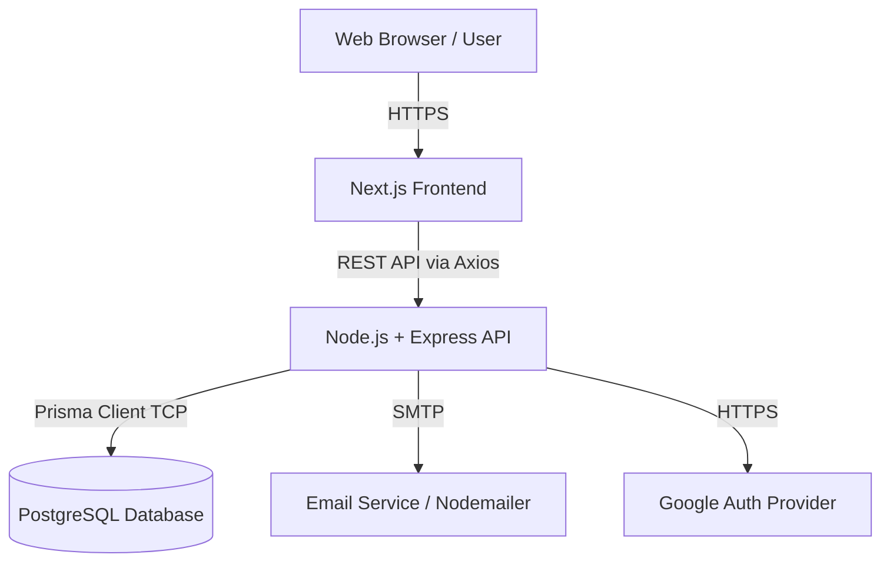
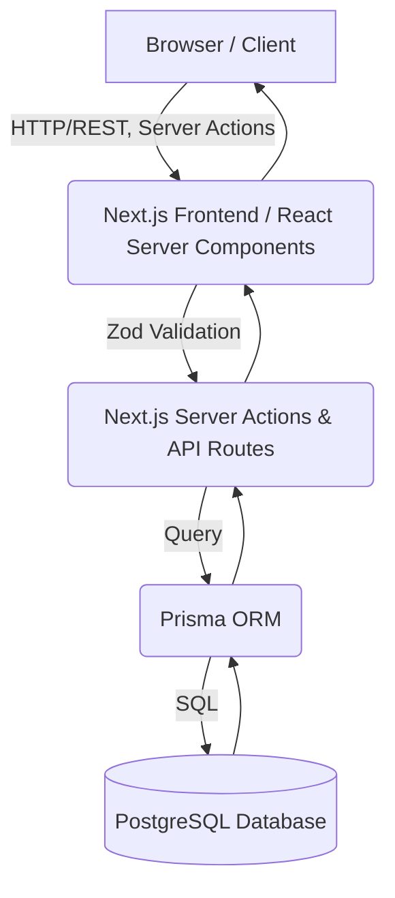
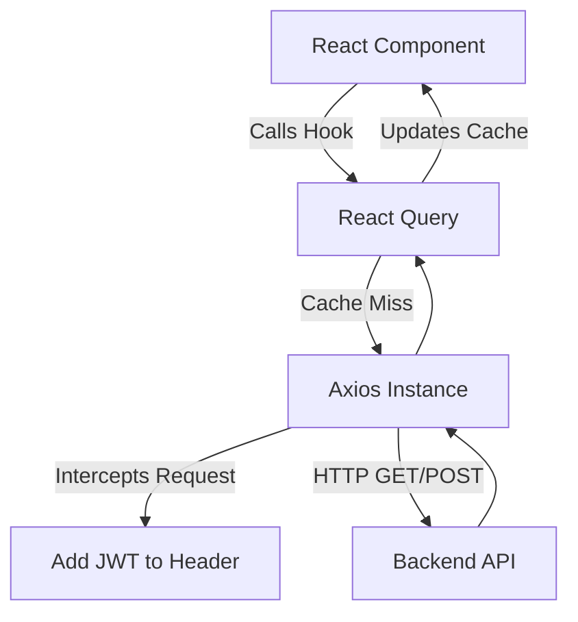
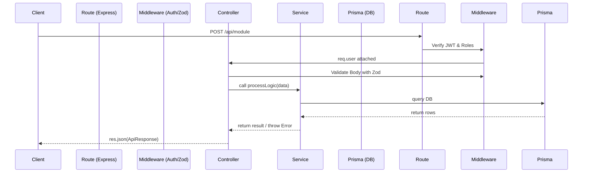

--- Original File: 01_Project_Architecture.md ---

# 01 Project Architecture

## 1. Introduction
This document explains the overarching system architecture of the Enterprise HRMS platform.

## 2. Purpose
To visualize how the independent subsystems (Frontend, Backend, Database, Third-Party Services) communicate and why they were decoupled.

## 3. Problem it Solves
A monolithic architecture often leads to deployment bottlenecks and tightly coupled codebases. By adopting a decoupled Client-Server architecture, we isolate UI rendering concerns from business logic and database management.

## 4. Why This Architecture?
We chose a decoupled **N-Tier Architecture** (Frontend Server, Backend API Server, Database Server) rather than a monolith. 
- **Scalability:** Frontend (Next.js) can be deployed to Vercel/Netlify/CDN independently from the Backend (Express), which can be scaled in Docker containers on AWS/GCP.
- **Security:** The database is never exposed directly to the internet; it only talks to the secure Node.js API layer.

## 5. Folder Location
`docs/01_Project_Architecture.md`

## 6. Architecture Diagram



## 7. System Components

### 7.1 Frontend Layer
- **Tech:** Next.js, React, TailwindCSS.
- **Role:** Handles presentation, client-side routing, local state (Zustand), server state caching (React Query), and internationalization (i18next).

### 7.2 API Layer
- **Tech:** Node.js, Express, TypeScript.
- **Role:** Handles business logic, RBAC validation, JWT verification, request parsing (Zod), and rate limiting. It acts as the gatekeeper.

### 7.3 Data Access Layer (DAL)
- **Tech:** Prisma ORM.
- **Role:** Abstracts raw SQL queries into type-safe TypeScript methods. Handles migrations and schema syncing.

### 7.4 Database Layer
- **Tech:** PostgreSQL.
- **Role:** Persistent, relational storage. Enforces referential integrity (Foreign Keys, Cascades) and indexing.

## 8. Request Flow
1. User clicks "Login" on Frontend.
2. Next.js triggers an Axios POST request to `api.domain.com/api/auth/login`.
3. Express router routes the request to `auth.controller.ts`.
4. Controller uses Zod to validate the payload.
5. Controller calls `auth.service.ts` containing the business logic.
6. Service queries the database using Prisma.
7. Service compares hashed password using `bcrypt`.
8. Service generates a JWT and passes it back to the controller.
9. Controller sends a 200 HTTP response.
10. Frontend receives JWT, stores it, and redirects to `/dashboard`.

## 9. Real Company Example
Netflix and Uber use similar multi-tier architectures, but scale them out into Microservices. For an HRMS, a Modular Monolith (where the backend is one codebase but logically separated into modules like Auth, Leave, Payroll) is the enterprise standard, as it provides the benefits of microservices (clean boundaries) without the operational overhead.

## 10. Alternative Implementation
- **Microservices:** Splitting Payroll, Attendance, and Auth into separate servers. *Why rejected?* Too much DevOps overhead for the current scale.
- **Serverless (Next.js API Routes):** Putting backend inside Next.js. *Why rejected?* Heavy background tasks (like Payroll generation) and persistent WebSocket connections run better on a dedicated Node/Express server.

## 11. Interview Questions
**Q: Why separate the frontend and backend instead of using Next.js API routes for everything?**
*Answer:* Separation of concerns. A dedicated Express server is better suited for long-running processes, complex background cron jobs (e.g., monthly payroll generation), WebSocket handling, and allows building mobile apps in the future that consume the exact same API.

## 12. Manager Questions
**Q: How does this architecture handle a sudden spike in traffic during morning check-ins?**
*Answer:* Because the Node.js API is stateless (using JWT instead of memory sessions), we can spin up multiple instances of the Express server behind a Load Balancer (like AWS ALB or NGINX) to handle high concurrent Attendance punches.

## 13. Summary
Our decoupled N-tier architecture ensures that the HRMS is highly scalable, secure, and maintainable. The clear boundary between presentation, business logic, and data access is the foundation of our enterprise-grade platform.


--- Original File: 02_ARCHITECTURE.md ---

# 02 - System Architecture

## Architecture Diagram



## Complete Request Flow

### 1. Employee Login Flow
1. **User Input**: Employee enters credentials in the Shadcn UI login form.
2. **Validation**: React Hook Form and Zod validate the input format on the client.
3. **Action**: A NextAuth `signIn` action is triggered.
4. **Backend**: Auth.js checks the database via Prisma to verify the hashed password.
5. **Session**: A JWT token is generated and stored in a secure HttpOnly cookie.
6. **Redirect**: Employee is redirected to the `/employee/dashboard` page.

### 2. Attendance Flow
1. **User Action**: Employee clicks "Punch In" on the dashboard.
2. **Client**: Zustand updates optimistic UI state.
3. **Server Action**: Next.js Server Action `recordAttendance` is called.
4. **Validation**: Server verifies session JWT and ensures no active punch-in exists.
5. **Database**: Prisma inserts a new `Attendance` record with the current timestamp.
6. **Response**: Server responds with success, UI is confirmed via TanStack Query invalidation.

### 3. Leave Approval Flow
1. **User Action**: HR Admin opens the "Pending Leaves" table and clicks "Approve".
2. **Client**: TanStack Query triggers a mutation.
3. **API Route**: `PATCH /api/leaves/:id/approve` is hit.
4. **Auth Check**: Middleware verifies the user has `hr_admin` role.
5. **Database**: Prisma updates the `Leave` record status to `APPROVED` and creates an `AuditLog` entry.
6. **Notification**: A Notification record is created for the employee.
7. **Response**: 200 OK. Client table refreshes automatically.


--- Original File: 02_Folder_Structure.md ---

# 02 Folder Structure

## 1. Introduction
This document explains the organization of files and directories across the frontend and backend repositories.

## 2. Purpose
To help developers quickly locate logic, components, and configuration files, ensuring a standardized approach to file placement.

## 3. Problem it Solves
In large codebases, developers waste hours looking for files. Without a standard folder structure, logic bleeds across layers (e.g., database queries written inside API controllers).

## 4. Why This Structure?
We use a **Domain-Driven Module Structure** for the backend (grouping by feature, e.g., `/modules/auth`, `/modules/attendance`) rather than a technical structure (grouping all controllers together, all services together). This keeps feature boundaries distinct.
For the frontend, we use the **Next.js App Router** structure, paired with a `src/` directory for components and utilities.

## 5. Folder Location
`docs/02_Folder_Structure.md`

## 6. Root Directory
```text
/HRMs Project
├── backend/            # Express Node.js Server
├── frontend/           # Next.js React Client
└── docs/               # Enterprise Developer Documentation
```

## 7. Backend Structure (`/backend`)
```text
backend/
├── prisma/               # Prisma ORM Schema & Seed Data
│   ├── schema.prisma     # Database models & relationships
│   └── seed.ts           # Initial DB seeding (Roles, Super Admin)
├── src/
│   ├── config/           # App-wide configs (Cloudinary, Multer, Environment)
│   ├── docs/             # Swagger OpenAPI configurations
│   ├── lib/              # Core libraries (Prisma client instance)
│   ├── middlewares/      # Express middlewares (Auth, Error Handler)
│   ├── modules/          # Domain-Driven Modules (Core Logic)
│   │   ├── auth/         # Auth routes, controller, service, schema
│   │   ├── attendance/   # Attendance logic
│   │   ├── documents/    # Secure document vault logic
│   │   └── ...           # Other modules (Leave, Payroll, etc.)
│   ├── utils/            # Helper functions (Mailer, ApiResponse formatter)
│   └── server.ts         # Express App Entry Point
├── .env                  # Environment Variables
└── package.json          # Dependencies
```

## 8. Frontend Structure (`/frontend`)
```text
frontend/
├── public/               # Static assets (images, icons)
├── src/
│   ├── app/              # Next.js App Router (Pages & Layouts)
│   │   ├── (auth)/       # Auth pages (Login, Register, Forgot Password)
│   │   ├── dashboard/    # Protected Dashboard routes
│   │   ├── layout.tsx    # Root layout & providers
│   │   └── page.tsx      # Landing page
│   ├── components/       # Reusable React Components
│   │   ├── layout/       # Navbar, Sidebar
│   │   ├── shared/       # PageHeaders, DataTables
│   │   └── ui/           # Base UI components (Buttons, Inputs, Dialogs)
│   ├── lib/              # Client utilities
│   │   ├── axios.ts      # Axios instance with Interceptors
│   │   └── i18n.ts       # i18next configuration & translations
│   ├── store/            # Global State Management (Zustand)
│   │   └── authStore.ts  # Session & User state
│   └── middleware.ts     # Next.js Edge Middleware for route protection
├── .env.local            # Environment Variables
├── tailwind.config.ts    # Tailwind CSS Configuration
└── package.json          # Dependencies
```

## 9. Real Company Example
Enterprise teams at Google or Microsoft strict enforce "Module isolation". By grouping `route.ts`, `controller.ts`, and `service.ts` into a single `auth` folder, a new developer assigned to "Authentication" only needs to understand that one folder, not the entire `/src` tree.

## 10. Interview Questions
**Q: Why use a 'modules' folder instead of grouping all controllers together and all services together?**
*Answer:* This is called Domain-Driven Design (DDD). It makes scaling easier. If the Auth module gets too big, it is much easier to extract it into its own microservice if all its routes, schemas, and services are already collocated.

## 11. Manager Questions
**Q: How do we ensure developers don't violate this structure?**
*Answer:* We use ESLint rules (like `eslint-plugin-import`) and strict code review processes to ensure imports don't cross boundaries improperly.

## 12. Summary
A predictable folder structure is the map to the codebase. By utilizing Domain-Driven structures on the backend and standard App Router conventions on the frontend, the HRMS codebase remains scalable and easy to navigate.


--- Original File: 03_Frontend_Architecture.md ---

# 03 Frontend Architecture

## 1. Introduction
This document explains the architecture of the frontend application built with Next.js, React, TailwindCSS, Zustand, and React Query.

## 2. Purpose
To clarify how state is managed, how routing works, and how data is fetched in the frontend without causing unnecessary re-renders.

## 3. Problem it Solves
Single Page Applications (SPAs) often suffer from "prop drilling", slow initial load times, and complex state synchronization with the backend. This architecture resolves these issues through App Router layouts, global stores, and intelligent caching.

## 4. Why This Approach?
- **Next.js App Router:** Provides intuitive file-based routing and nested layouts, preventing re-renders of navigation bars when changing pages.
- **Zustand:** Chosen over Redux for global state (like user session) because it requires zero boilerplate and works seamlessly with hooks.
- **React Query:** Chosen for data fetching. It handles caching, background refetching, and loading/error states automatically, removing the need for complex `useEffect` chains.

## 5. Folder Location
`docs/03_Frontend_Architecture.md`

## 6. Frontend Flow Diagram



## 7. Key Files and Patterns

### Axios Interceptor (`lib/axios.ts`)
We use a centralized Axios instance.
- **Why?** Instead of manually attaching the JWT token to every single API request, the interceptor automatically reads the token from `Zustand` and injects it into the `Authorization` header. It also centrally handles 401 Unauthorized errors by redirecting the user to login.

### React Query (`@tanstack/react-query`)
Used for Server State.
- **Why?** It isolates UI state from Server state. For example, when viewing the Employee List, React Query fetches the data, caches it, and if the user navigates away and back, it serves the cache instantly while silently refetching in the background.

### Zustand (`store/authStore.ts`)
Used for Client State.
- **Why?** Stores the `user` object and the `token`. We persist this state to `localStorage` using Zustand's `persist` middleware, so the user stays logged in across page refreshes.

## 8. Routing and Layouts
- `app/layout.tsx`: Contains global providers (QueryClientProvider, I18nProvider).
- `app/dashboard/layout.tsx`: Contains the Sidebar and Topbar. Wrapping all dashboard pages ensures these components are never unmounted when switching between Attendance and Leave modules.
- `app/(auth)`: A route group that shares no layout with the dashboard.

## 9. Real Company Example
Spotify’s web player uses similar caching mechanisms (like React Query) to ensure that when you navigate back to an album, it loads instantly from memory rather than fetching from the server again. 

## 10. Alternative Implementation
- **Redux Toolkit + RTK Query:** *Why rejected?* Redux introduces significant boilerplate. Zustand + React Query is lighter, more modern, and faster to iterate with for an HRMS.

## 11. Interview Questions
**Q: What is the difference between Client State and Server State?**
*Answer:* Server state is data that lives on the backend (e.g., list of employees). It can become out of sync and requires asynchronous fetching and caching (handled by React Query). Client state is transient UI state (e.g., "is the sidebar open?" or "current logged-in user details"), which is synchronous and handled by Zustand or `useState`.

## 12. Manager Questions
**Q: How does the frontend handle slow networks?**
*Answer:* React Query provides `isLoading` and `isFetching` states that we use to display skeleton loaders. Furthermore, we use optimistic updates for instant UI feedback before the server responds.

## 13. Summary
The frontend is heavily optimized for Developer Experience (DX) and User Experience (UX) by cleanly separating server data caching from local UI state, governed by Next.js's robust routing.


--- Original File: 04_Backend_Architecture.md ---

# 04 Backend Architecture

## 1. Introduction
This document explains the architecture of the Node.js/Express backend that powers the HRMS platform.

## 2. Purpose
To explain the boundaries between Routes, Controllers, and Services, and how requests are processed safely and efficiently.

## 3. Problem it Solves
"Fat controllers" (where routing, validation, business logic, and database queries exist in one huge function) are impossible to test and maintain. This architecture solves that by strictly separating concerns into specific layers.

## 4. Why This Approach?
We use a **3-Layer Architecture** (Controller-Service-Data Access).
- **Routes:** Only map URLs to Controller functions.
- **Controllers:** Only handle HTTP concepts (req, res), validate input (Zod), call the Service, and return standard API responses.
- **Services:** Contain the pure business logic. They do NOT know about HTTP, `req`, or `res`. They only take raw parameters, talk to the database (Prisma), and return data or throw Errors.

## 5. Folder Location
`docs/04_Backend_Architecture.md`

## 6. Backend Flow Diagram



## 7. Key Files and Patterns

### Route (`*.route.ts`)
Maps HTTP methods to controller functions and attaches middlewares (e.g., `authenticate`, `authorize(['HR', 'ADMIN'])`).

### Controller (`*.controller.ts`)
Validates `req.body` using Zod schemas. If validation fails, it immediately returns a 400 error. If it succeeds, it invokes the Service layer. Uses a consistent `ApiResponse` class for all outputs.

### Service (`*.service.ts`)
The core engine. For example, `generatePayroll(employeeId)` lives here. If a business rule fails (e.g., "Employee is inactive"), it throws a standard JavaScript `Error` which the controller catches and translates into a 400/403 HTTP response.

### Schema (`*.schema.ts`)
Zod definitions for validating incoming payloads. Ensures that the Service layer never receives malformed data.

## 8. Real Company Example
At companies like Stripe, the core payment processing logic (Service) is completely decoupled from the API endpoints (Controllers). This allows them to trigger the exact same Service logic from an HTTP API call, a CRON job, or a CLI tool without duplicating code.

## 9. Interview Questions
**Q: Why shouldn't we write database queries inside the Controller?**
*Answer:* If you write queries in the controller, that business logic becomes tightly coupled to the HTTP context. If you later need to trigger that same logic from a scheduled Cron Job (which has no `req` or `res`), you would have to duplicate the code. Putting it in a Service makes it universally callable.

## 10. Manager Questions
**Q: How do we handle unexpected server crashes?**
*Answer:* All controllers wrap their logic in `try/catch` blocks, passing uncaught errors to `next(error)`. We have a global Error Handling Middleware at the end of `server.ts` that catches these, logs them securely, and returns a graceful 500 error to the client instead of crashing the Node process.

## 11. Summary
The strict 3-Layer architecture of the backend ensures that business logic is isolated, reusable, and easy to test, while maintaining a predictable HTTP interface for the frontend.


--- Original File: 05_PROJECT_DIRECTORY_STRUCTURE.md ---

# 05 - Project Directory Structure

## Complete Folder Structure

This project uses a feature-based architecture for scalability and maintainability.

```text
hrms/
├── docs/                     # Project documentation
├── prisma/                   # Prisma schema and migrations
│   └── schema.prisma         # Database schema
├── src/
│   ├── app/                  # Next.js App Router root
│   │   ├── (auth)/           # Authentication routes (login, forgot password)
│   │   ├── (employee)/       # Employee dashboard and routes
│   │   ├── (hr)/             # HR Admin dashboard and routes
│   │   ├── (admin)/          # Super Admin dashboard and routes
│   │   ├── api/              # API Route Handlers
│   │   ├── layout.tsx        # Root layout
│   │   └── page.tsx          # Landing page
│   ├── components/
│   │   ├── ui/               # Shadcn UI reusable components (buttons, inputs)
│   │   ├── shared/           # Shared components across roles (Navbar, Sidebar)
│   │   ├── employee/         # Employee-specific UI components
│   │   ├── hr/               # HR-specific UI components
│   │   └── admin/            # Admin-specific UI components
│   ├── features/             # Feature-based domains (logic, queries, stores)
│   │   ├── auth/             # Authentication logic
│   │   ├── employee/         # Employee profile management
│   │   ├── attendance/       # Attendance tracking logic
│   │   ├── leave/            # Leave management
│   │   ├── notifications/    # Real-time and email notifications
│   │   └── analytics/        # Dashboard charts and metrics
│   ├── actions/              # Next.js Server Actions (data mutations)
│   ├── lib/                  # Utility functions and configurations
│   │   ├── prisma.ts         # Prisma client instantiation
│   │   └── utils.ts          # Tailwind merge and utility helpers
│   ├── hooks/                # Custom React hooks
│   ├── services/             # External service integrations (e.g., email, storage)
│   ├── repositories/         # Database access abstraction layer
│   ├── validators/           # Zod schemas for request validation
│   ├── types/                # TypeScript interfaces and types
│   └── store/                # Zustand global state stores
└── middleware.ts             # Next.js Middleware for route protection & RBAC
```

## Important Files Explained

- **`middleware.ts`**: Runs before every request. Crucial for verifying the JWT token and checking RBAC roles. E.g., preventing an `employee` from accessing `(hr)` routes.
- **`lib/prisma.ts`**: Ensures that in development, we don't exhaust connection pools by creating multiple Prisma Client instances during hot reloads.
- **`actions/` vs `api/`**: We use `actions/` for form submissions and mutations (React Server Actions) directly from Client Components. We use `api/` for webhooks, external integrations, or GET requests consumed by TanStack Query.
- **`validators/`**: Contains Zod schemas (e.g., `LeaveRequestSchema`). Used both on the client for form validation and on the server for payload validation.


--- Original File: 08_UI_ARCHITECTURE.md ---

# 08 - Enterprise UI Architecture

## Design System Overview

This application leverages **Tailwind CSS v4** for utility-first styling and **Shadcn UI** for accessible, customizable, and high-quality React components. 

### Core Components

- **Layouts**: 
  - Uses a persistent shell containing a Sidebar and a Top Navbar.
  - The main content area is responsive, taking up the remaining space.
  
- **Sidebar**:
  - Collapsible (icon-only mode vs full mode).
  - Navigation links change dynamically based on the user's RBAC role.
  - Contains grouped sections (e.g., Personal, Management, System).

- **Navbar**:
  - Contains global search.
  - User profile dropdown menu (Profile, Settings, Logout).
  - Notification bell with an unread badge and dropdown list.

- **Breadcrumbs**:
  - Placed below the Navbar.
  - Automatically generated based on the current Next.js route, providing clear orientation (e.g., Home > HR Management > Employee Directory).

- **Data Tables**:
  - Built using `@tanstack/react-table` combined with Shadcn UI.
  - Features: Server-side pagination, global/column filtering, sorting, and row selection.
  - Action menus (three dots icon) at the end of rows for Edit/Delete actions.

- **Forms**:
  - Managed by `react-hook-form` and validated via `zod`.
  - Uses Shadcn UI's Form wrapper to display inline error messages seamlessly.
  - Complex forms are divided into Stepper wizards (e.g., Onboarding a new employee).

- **Cards**:
  - Used heavily in dashboards to display metrics (e.g., Total Employees, Leaves Pending).
  - Contains a title, a large metric value, and a sparkline or percentage change indicator.

- **Modals / Dialogs**:
  - Used for disruptive actions that require focus (e.g., "Are you sure you want to reject this leave?").
  - Includes a semi-transparent backdrop blur.

- **Notifications / Toasts**:
  - Uses Shadcn's `use-toast` hook.
  - Appears in the bottom-right corner for success, error, or informational alerts (e.g., "Attendance marked successfully").

## Visual Aesthetics
- **Color Palette**: Professional corporate scheme. Primary blue (`blue-600`), neutral grays for backgrounds, and semantic colors (green for approved, yellow for pending, red for rejected/error).
- **Typography**: `Inter` font for clean, highly legible data presentation.
- **Dark Mode**: Fully supported via Tailwind's `dark:` classes and `next-themes`.
