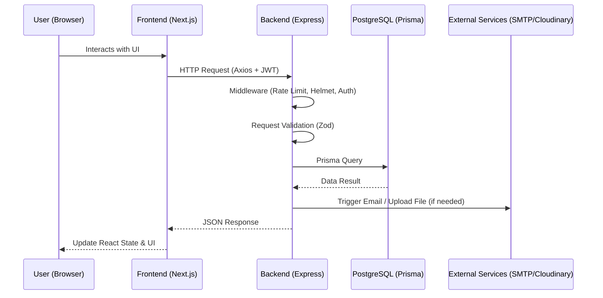
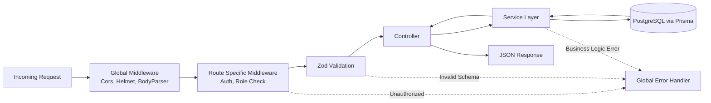

# 02. System Architecture

## Architecture Overview
The Enterprise HRMS utilizes a **Decoupled Client-Server Architecture**. 
- The frontend is an SPA/SSR hybrid built with **Next.js**.
- The backend is a stateless RESTful API built with **Express.js**.
- The database is a relational **PostgreSQL** instance managed via **Prisma ORM**.

This separation of concerns ensures that the frontend and backend can scale independently, be developed by separate teams, and securely isolate the database from the public internet.

## High-Level Component Interaction

## Frontend Architecture (Next.js)

### Directory Structure Alignment
The frontend follows the **App Router** paradigm (`src/app/`):
- `(auth)/`: Grouped routes for Login, Register, Forgot Password.
- `dashboard/`: Protected routes for the main HRMS interface.
- `components/`: Reusable UI components (shadcn/ui, Layouts, Charts).
- `lib/`: Utility functions (Axios instance, formatting, constants).
- `store/`: Zustand state stores (User session, Theme).

### State Management
1. **Server State**: Managed by `React Query`. It handles caching, background fetching, deduplication, and optimistic updates for API responses.
2. **Client State**: Managed by `Zustand`. It stores non-persistent UI states like Sidebar collapse status, active theme (Dark/Light), and user session tokens between renders.

## Backend Architecture (Express.js)

The backend follows an **MVC (Model-View-Controller) / Service-Oriented** pattern for maintainability:
- **Routes**: Define API endpoints and attach middleware.
- **Controllers**: Handle HTTP request/response logic, extract parameters, and call services.
- **Services**: Contain the core business logic, calculations, and Prisma DB calls.
- **Middlewares**: Intercept requests for Authentication (`verifyToken`), Authorization (`checkRole`), and Validation (`validateSchema`).
- **Validations**: Zod schemas defining the strict shape of incoming requests.

### Request Lifecycle

## Database Architecture (PostgreSQL + Prisma)

### Why PostgreSQL?
Payroll and Attendance data require strict mathematical precision, relational integrity (Foreign Keys), and ACID compliance. PostgreSQL prevents orphaned records (e.g., deleting a Department cascade-updates or blocks deletion if Employees are attached).

### Why Prisma?
Prisma provides type-safe database access. Instead of raw SQL strings which are prone to runtime errors and injection attacks, Prisma generates a TypeScript client based on the `schema.prisma` file, ensuring compile-time errors if the database structure changes.

## Security Layers

1. **Edge/Network**: CORS restricted to frontend domain. Rate limiting (`express-rate-limit`) prevents brute force.
2. **Application**: JWT for stateless session management. Passwords hashed using `bcrypt` (Factor 10+).
3. **Database**: Prisma automatically parameterizes all queries, neutralizing SQL Injection (SQLi) attacks.
