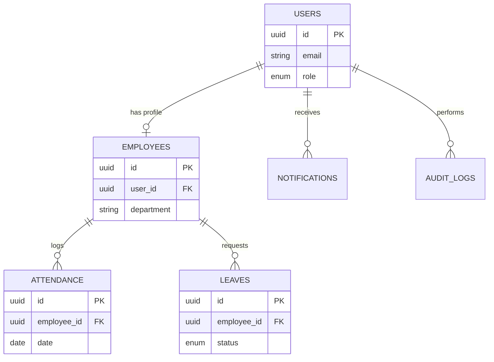

# 03 - Database Design

## Tables Overview

### 1. `users`
* **Purpose**: Core authentication and authorization records.
* **Columns**: 
  - `id` (UUID, Primary Key)
  - `email` (String, Unique)
  - `password_hash` (String)
  - `role` (Enum: `employee`, `hr_admin`, `super_admin`)
  - `created_at`, `updated_at` (DateTime)
* **Relationships**: 1-to-1 with `employees`.

### 2. `employees`
* **Purpose**: HR profile data for employees.
* **Columns**:
  - `id` (UUID, Primary Key)
  - `user_id` (UUID, Foreign Key)
  - `first_name`, `last_name` (String)
  - `department` (String)
  - `designation` (String)
  - `joining_date` (Date)
* **Relationships**: 1-to-many with `attendance`, `leaves`.

### 3. `attendance`
* **Purpose**: Tracking daily punch-in and punch-out.
* **Columns**:
  - `id` (UUID, Primary Key)
  - `employee_id` (UUID, Foreign Key)
  - `date` (Date)
  - `punch_in` (DateTime)
  - `punch_out` (DateTime, Nullable)
* **Indexes**: Index on `(employee_id, date)`.

### 4. `leaves`
* **Purpose**: Leave applications and approval status.
* **Columns**:
  - `id` (UUID, Primary Key)
  - `employee_id` (UUID, Foreign Key)
  - `start_date`, `end_date` (Date)
  - `type` (Enum: `sick`, `casual`, `earned`)
  - `status` (Enum: `pending`, `approved`, `rejected`)
  - `reason` (Text)

### 5. `notifications`
* **Purpose**: In-app alerts for users.
* **Columns**:
  - `id` (UUID, Primary Key)
  - `user_id` (UUID, Foreign Key)
  - `title` (String)
  - `message` (Text)
  - `is_read` (Boolean, Default: false)

### 6. `audit_logs`
* **Purpose**: Security and compliance tracking.
* **Columns**:
  - `id` (UUID, Primary Key)
  - `action` (String)
  - `performed_by` (UUID, Foreign Key -> users)
  - `entity_type`, `entity_id` (String)
  - `timestamp` (DateTime)

### 7. `settings`
* **Purpose**: Global system configurations.
* **Columns**:
  - `id` (UUID, Primary Key)
  - `key` (String, Unique)
  - `value` (JSONB)

## ER Diagram

