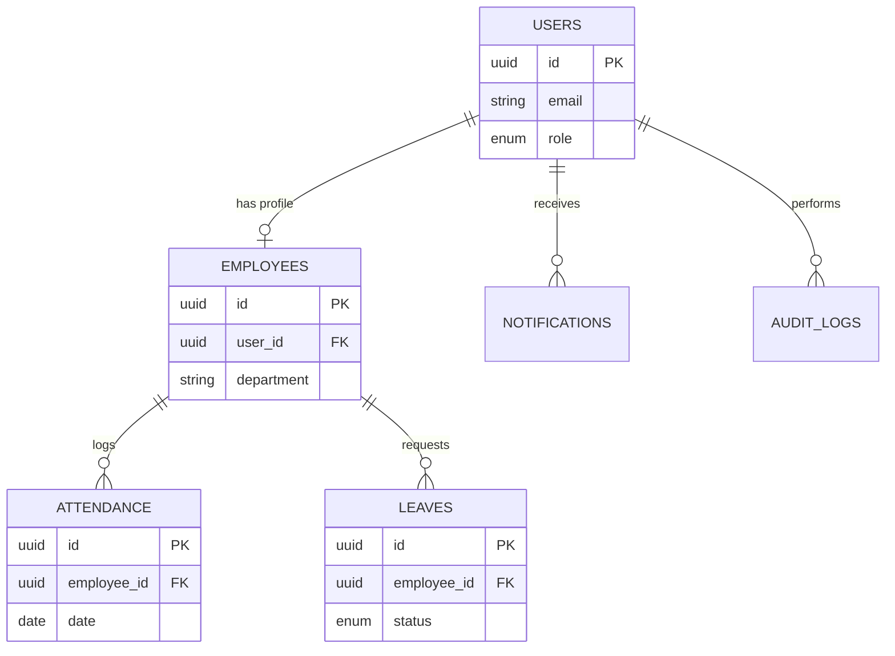
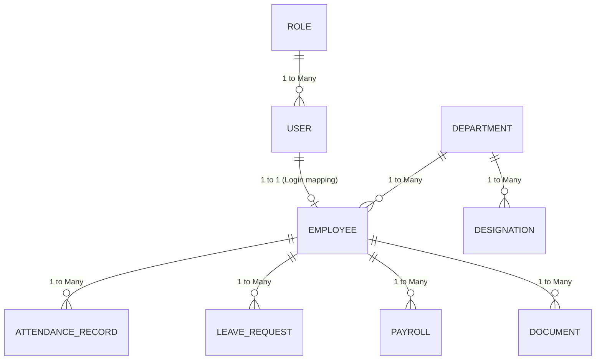

--- Original File: 03_DATABASE_DESIGN.md ---

# 03 - Database Design

## Tables Overview

### 1. `users`
* **Purpose**: Core authentication and authorization records.
* **Columns**: 
  - `id` (UUID, Primary Key)
  - `email` (String, Unique)
  - `password_hash` (String)
  - `role` (Enum: `employee`, `hr_admin`, `super_admin`)
  - `created_at`, `updated_at` (DateTime)
* **Relationships**: 1-to-1 with `employees`.

### 2. `employees`
* **Purpose**: HR profile data for employees.
* **Columns**:
  - `id` (UUID, Primary Key)
  - `user_id` (UUID, Foreign Key)
  - `first_name`, `last_name` (String)
  - `department` (String)
  - `designation` (String)
  - `joining_date` (Date)
* **Relationships**: 1-to-many with `attendance`, `leaves`.

### 3. `attendance`
* **Purpose**: Tracking daily punch-in and punch-out.
* **Columns**:
  - `id` (UUID, Primary Key)
  - `employee_id` (UUID, Foreign Key)
  - `date` (Date)
  - `punch_in` (DateTime)
  - `punch_out` (DateTime, Nullable)
* **Indexes**: Index on `(employee_id, date)`.

### 4. `leaves`
* **Purpose**: Leave applications and approval status.
* **Columns**:
  - `id` (UUID, Primary Key)
  - `employee_id` (UUID, Foreign Key)
  - `start_date`, `end_date` (Date)
  - `type` (Enum: `sick`, `casual`, `earned`)
  - `status` (Enum: `pending`, `approved`, `rejected`)
  - `reason` (Text)

### 5. `notifications`
* **Purpose**: In-app alerts for users.
* **Columns**:
  - `id` (UUID, Primary Key)
  - `user_id` (UUID, Foreign Key)
  - `title` (String)
  - `message` (Text)
  - `is_read` (Boolean, Default: false)

### 6. `audit_logs`
* **Purpose**: Security and compliance tracking.
* **Columns**:
  - `id` (UUID, Primary Key)
  - `action` (String)
  - `performed_by` (UUID, Foreign Key -> users)
  - `entity_type`, `entity_id` (String)
  - `timestamp` (DateTime)

### 7. `settings`
* **Purpose**: Global system configurations.
* **Columns**:
  - `id` (UUID, Primary Key)
  - `key` (String, Unique)
  - `value` (JSONB)

## ER Diagram




--- Original File: 04_PRISMA_SCHEMA.md ---

# 04 - Prisma Schema

```prisma
generator client {
  provider = "prisma-client-js"
}

datasource db {
  provider = "postgresql"
  url      = env("DATABASE_URL")
}

enum Role {
  EMPLOYEE
  HR_ADMIN
  SUPER_ADMIN
}

enum LeaveType {
  SICK
  CASUAL
  EARNED
}

enum LeaveStatus {
  PENDING
  APPROVED
  REJECTED
}

model User {
  id            String         @id @default(uuid())
  email         String         @unique
  passwordHash  String
  role          Role           @default(EMPLOYEE)
  employee      Employee?
  notifications Notification[]
  auditLogs     AuditLog[]
  createdAt     DateTime       @default(now())
  updatedAt     DateTime       @updatedAt

  @@index([email])
}

model Employee {
  id          String       @id @default(uuid())
  userId      String       @unique
  user        User         @relation(fields: [userId], references: [id], onDelete: Cascade)
  firstName   String
  lastName    String
  department  String
  designation String
  joiningDate DateTime
  attendance  Attendance[]
  leaves      Leave[]
  createdAt   DateTime     @default(now())
  updatedAt   DateTime     @updatedAt

  @@index([department])
}

model Attendance {
  id         String    @id @default(uuid())
  employeeId String
  employee   Employee  @relation(fields: [employeeId], references: [id], onDelete: Cascade)
  date       DateTime  @db.Date
  punchIn    DateTime
  punchOut   DateTime?
  createdAt  DateTime  @default(now())
  updatedAt  DateTime  @updatedAt

  @@unique([employeeId, date])
  @@index([employeeId])
}

model Leave {
  id         String      @id @default(uuid())
  employeeId String
  employee   Employee    @relation(fields: [employeeId], references: [id], onDelete: Cascade)
  startDate  DateTime    @db.Date
  endDate    DateTime    @db.Date
  type       LeaveType
  status     LeaveStatus @default(PENDING)
  reason     String
  createdAt  DateTime    @default(now())
  updatedAt  DateTime    @updatedAt

  @@index([employeeId, status])
}

model Notification {
  id        String   @id @default(uuid())
  userId    String
  user      User     @relation(fields: [userId], references: [id], onDelete: Cascade)
  title     String
  message   String
  isRead    Boolean  @default(false)
  createdAt DateTime @default(now())

  @@index([userId, isRead])
}

model AuditLog {
  id          String   @id @default(uuid())
  action      String
  performedBy String
  user        User     @relation(fields: [performedBy], references: [id])
  entityType  String
  entityId    String
  timestamp   DateTime @default(now())

  @@index([performedBy])
  @@index([entityType, entityId])
}

model Settings {
  id        String   @id @default(uuid())
  key       String   @unique
  value     Json
  updatedAt DateTime @updatedAt
}
```


--- Original File: 05_Database_Architecture.md ---

# 05 Database Architecture

## 1. Introduction
This document explains the Database Architecture, focusing on our PostgreSQL implementation and the Prisma ORM layer.

## 2. Purpose
To detail the relational structure of the core HRMS entities and explain how referential integrity and performance are maintained.

## 3. Problem it Solves
Managing a large workforce requires structured data. Storing relationships (e.g., an Employee belongs to a Department, has many Attendance Records, and reports to a Manager) in a NoSQL database can lead to data inconsistency. A relational database (RDBMS) solves this.

## 4. Why PostgreSQL + Prisma?
- **PostgreSQL:** The most advanced open-source RDBMS. Excellent for complex joins, transactions (essential for Payroll), and ACID compliance.
- **Prisma:** A modern Node.js ORM that generates fully type-safe TypeScript clients. It prevents SQL injection by default and makes schema migrations trackable in Git.

## 5. Folder Location
`docs/05_Database_Architecture.md`

## 6. Database Flow Diagram



## 7. Key Architectural Decisions

### UUIDs for Primary Keys
We use `String @id @default(uuid())` instead of auto-incrementing Integers.
- **Why?** UUIDs prevent ID guessing attacks (e.g., changing `/api/employee/1` to `/api/employee/2`). They also make database merging easier in microservice architectures.

### Referential Actions (Cascades)
Certain relations use `@relation(onDelete: Cascade)`. For example, deleting a Role deletes all RolePermissions associated with it. However, we do NOT cascade delete Employees when a Department is deleted. Instead, we use soft deletes or restrict deletion to prevent historical data loss (crucial for HR compliance).

### Separation of User and Employee
- `User` table handles system login credentials (email, password hash, RBAC roles).
- `Employee` table handles HR data (DOB, Department, Salary).
- **Why?** Security and flexibility. An external auditor might need a `User` account to log in, but they are not an `Employee`. Similarly, a past employee's `User` account can be deactivated while their `Employee` record remains for tax purposes.

## 8. Real Company Example
At enterprise companies, HR data (like Payroll and Documents) is heavily audited. By strictly separating the `User` identity from the `Employee` profile, we ensure that authentication audits (who logged in) are distinct from HR audits (when was someone hired).

## 9. Interview Questions
**Q: Why use Prisma over writing raw SQL queries?**
*Answer:* Prisma provides type-safety. If we change a column name in the database, TypeScript will throw a compile-time error wherever that column is used in our code. Raw SQL wouldn't fail until runtime, which could cause a production outage.

## 10. Manager Questions
**Q: What happens if an employee is deleted, but we need their payroll history for tax audits?**
*Answer:* In an enterprise system, we don't `DELETE FROM Employee`. We update a `status` column to `TERMINATED` or `INACTIVE` (Soft Delete). The Prisma queries in the application automatically filter out inactive employees from the active directory, but the historical payroll records remain completely intact.

## 11. Summary
The PostgreSQL database, mapped via Prisma, provides a highly relational, type-safe, and secure foundation for the HRMS, ensuring data consistency even as the platform scales.
