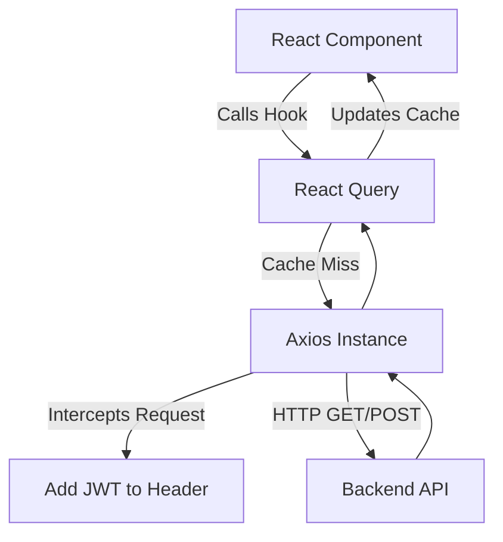

# 03 Frontend Architecture

## 1. Introduction
This document explains the architecture of the frontend application built with Next.js, React, TailwindCSS, Zustand, and React Query.

## 2. Purpose
To clarify how state is managed, how routing works, and how data is fetched in the frontend without causing unnecessary re-renders.

## 3. Problem it Solves
Single Page Applications (SPAs) often suffer from "prop drilling", slow initial load times, and complex state synchronization with the backend. This architecture resolves these issues through App Router layouts, global stores, and intelligent caching.

## 4. Why This Approach?
- **Next.js App Router:** Provides intuitive file-based routing and nested layouts, preventing re-renders of navigation bars when changing pages.
- **Zustand:** Chosen over Redux for global state (like user session) because it requires zero boilerplate and works seamlessly with hooks.
- **React Query:** Chosen for data fetching. It handles caching, background refetching, and loading/error states automatically, removing the need for complex `useEffect` chains.

## 5. Folder Location
`docs/03_Frontend_Architecture.md`

## 6. Frontend Flow Diagram

## 7. Key Files and Patterns

### Axios Interceptor (`lib/axios.ts`)
We use a centralized Axios instance.
- **Why?** Instead of manually attaching the JWT token to every single API request, the interceptor automatically reads the token from `Zustand` and injects it into the `Authorization` header. It also centrally handles 401 Unauthorized errors by redirecting the user to login.

### React Query (`@tanstack/react-query`)
Used for Server State.
- **Why?** It isolates UI state from Server state. For example, when viewing the Employee List, React Query fetches the data, caches it, and if the user navigates away and back, it serves the cache instantly while silently refetching in the background.

### Zustand (`store/authStore.ts`)
Used for Client State.
- **Why?** Stores the `user` object and the `token`. We persist this state to `localStorage` using Zustand's `persist` middleware, so the user stays logged in across page refreshes.

## 8. Routing and Layouts
- `app/layout.tsx`: Contains global providers (QueryClientProvider, I18nProvider).
- `app/dashboard/layout.tsx`: Contains the Sidebar and Topbar. Wrapping all dashboard pages ensures these components are never unmounted when switching between Attendance and Leave modules.
- `app/(auth)`: A route group that shares no layout with the dashboard.

## 9. Real Company Example
Spotify’s web player uses similar caching mechanisms (like React Query) to ensure that when you navigate back to an album, it loads instantly from memory rather than fetching from the server again. 

## 10. Alternative Implementation
- **Redux Toolkit + RTK Query:** *Why rejected?* Redux introduces significant boilerplate. Zustand + React Query is lighter, more modern, and faster to iterate with for an HRMS.

## 11. Interview Questions
**Q: What is the difference between Client State and Server State?**
*Answer:* Server state is data that lives on the backend (e.g., list of employees). It can become out of sync and requires asynchronous fetching and caching (handled by React Query). Client state is transient UI state (e.g., "is the sidebar open?" or "current logged-in user details"), which is synchronous and handled by Zustand or `useState`.

## 12. Manager Questions
**Q: How does the frontend handle slow networks?**
*Answer:* React Query provides `isLoading` and `isFetching` states that we use to display skeleton loaders. Furthermore, we use optimistic updates for instant UI feedback before the server responds.

## 13. Summary
The frontend is heavily optimized for Developer Experience (DX) and User Experience (UX) by cleanly separating server data caching from local UI state, governed by Next.js's robust routing.
