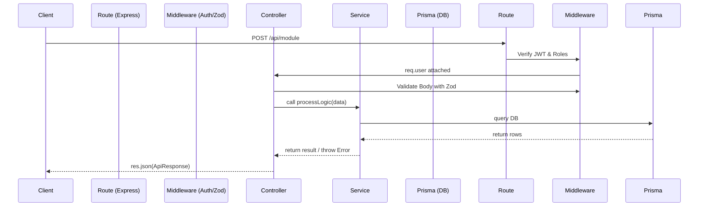

# 04 Backend Architecture

## 1. Introduction
This document explains the architecture of the Node.js/Express backend that powers the HRMS platform.

## 2. Purpose
To explain the boundaries between Routes, Controllers, and Services, and how requests are processed safely and efficiently.

## 3. Problem it Solves
"Fat controllers" (where routing, validation, business logic, and database queries exist in one huge function) are impossible to test and maintain. This architecture solves that by strictly separating concerns into specific layers.

## 4. Why This Approach?
We use a **3-Layer Architecture** (Controller-Service-Data Access).
- **Routes:** Only map URLs to Controller functions.
- **Controllers:** Only handle HTTP concepts (req, res), validate input (Zod), call the Service, and return standard API responses.
- **Services:** Contain the pure business logic. They do NOT know about HTTP, `req`, or `res`. They only take raw parameters, talk to the database (Prisma), and return data or throw Errors.

## 5. Folder Location
`docs/04_Backend_Architecture.md`

## 6. Backend Flow Diagram

## 7. Key Files and Patterns

### Route (`*.route.ts`)
Maps HTTP methods to controller functions and attaches middlewares (e.g., `authenticate`, `authorize(['HR', 'ADMIN'])`).

### Controller (`*.controller.ts`)
Validates `req.body` using Zod schemas. If validation fails, it immediately returns a 400 error. If it succeeds, it invokes the Service layer. Uses a consistent `ApiResponse` class for all outputs.

### Service (`*.service.ts`)
The core engine. For example, `generatePayroll(employeeId)` lives here. If a business rule fails (e.g., "Employee is inactive"), it throws a standard JavaScript `Error` which the controller catches and translates into a 400/403 HTTP response.

### Schema (`*.schema.ts`)
Zod definitions for validating incoming payloads. Ensures that the Service layer never receives malformed data.

## 8. Real Company Example
At companies like Stripe, the core payment processing logic (Service) is completely decoupled from the API endpoints (Controllers). This allows them to trigger the exact same Service logic from an HTTP API call, a CRON job, or a CLI tool without duplicating code.

## 9. Interview Questions
**Q: Why shouldn't we write database queries inside the Controller?**
*Answer:* If you write queries in the controller, that business logic becomes tightly coupled to the HTTP context. If you later need to trigger that same logic from a scheduled Cron Job (which has no `req` or `res`), you would have to duplicate the code. Putting it in a Service makes it universally callable.

## 10. Manager Questions
**Q: How do we handle unexpected server crashes?**
*Answer:* All controllers wrap their logic in `try/catch` blocks, passing uncaught errors to `next(error)`. We have a global Error Handling Middleware at the end of `server.ts` that catches these, logs them securely, and returns a graceful 500 error to the client instead of crashing the Node process.

## 11. Summary
The strict 3-Layer architecture of the backend ensures that business logic is isolated, reusable, and easy to test, while maintaining a predictable HTTP interface for the frontend.
