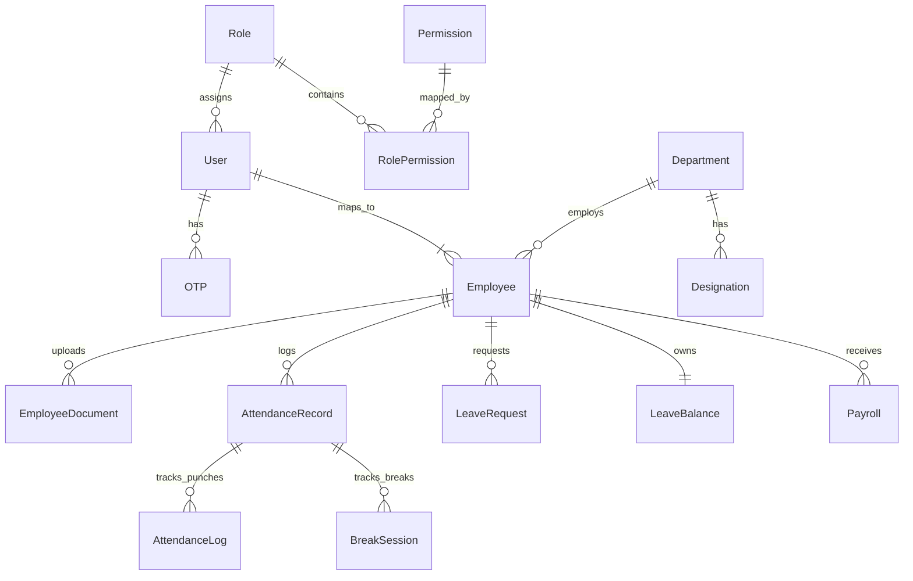

# 04. Database Design

## Overview
The Enterprise HRMS utilizes **PostgreSQL**, accessed and managed via **Prisma ORM**. The database is highly relational, utilizing Foreign Keys, cascading deletes, and unique constraints to maintain absolute data integrity for HR operations.

## Core Domain Models

### 1. Authentication & RBAC
- **`User`**: Core system identity. Stores `email`, `passwordHash` (bcrypt), `twoFactorEnabled`, and links to `Role` and `Employee`.
- **`Role`**: Represents a user tier (e.g., SUPER_ADMIN, HR_ADMIN, EMPLOYEE).
- **`Permission`**: Granular access rights (e.g., "VIEW_USERS", "APPROVE_LEAVE").
- **`RolePermission`**: Junction table mapping many-to-many relationship between Roles and Permissions.
- **`OTP`**: Temporary table storing hashed OTPs and expirations for password resets and verification.

### 2. Organizational Structure
- **`Department`**: Logical grouping (e.g., "Engineering", "Finance"). Has a `managerId` pointing to an `Employee`.
- **`Designation`**: Job titles within a department (e.g., "Senior Software Engineer"). Contains a `level` field for hierarchy.
- **`Employee`**: The central operational model.
  - Links to `Department`, `Designation`, `Shift`.
  - Links to a `managerId` (self-referential relation for reporting hierarchy).
  - Contains extensive PII (DOB, Blood Group, Address, Emergency Contacts, Bank Details).

### 3. Attendance & Time Tracking
- **`Shift`**: Defines working hours, grace time, break durations, and weekly off days.
- **`AttendanceRecord`**: Created daily per employee. Tracks `date`, `status` (PRESENT, ABSENT, HALF_DAY), `grossHours`, and `effectiveHours`.
- **`AttendanceLog`**: Child of AttendanceRecord. Captures every individual punch-in/out event along with `ipAddress` and `gpsLocation`.
- **`BreakSession`**: Child of AttendanceRecord. Tracks exact break timings.
- **`AttendanceCorrection`**: Request generated by an employee when a punch is missed. Requires Manager/HR approval.

### 4. Leave Management
- **`LeaveBalance`**: 1-to-1 with Employee. Tracks numerical limits for Annual, Casual, Medical, Earned, and Comp-Off leaves.
- **`LeaveRequest`**: Tracks leave history. Captures `startDate`, `endDate`, `leaveType`, and `status`.

### 5. Payroll & Finance
- **`Payroll`**: Generated monthly. 
  - **Earnings**: `basicSalary`, `hra`, `bonus`, `grossSalary`.
  - **Deductions**: `providentFund`, `esi`, `incomeTax`, `deductions`.
  - **Result**: `netSalary`, `paymentDate`, `status`.
- **`PayrollQuery`**: Support tickets raised by employees against specific payslips (e.g., "TAX_ISSUE").

### 6. Document Management
- **`EmployeeDocument`**: Compliance files (Aadhaar, PAN). Tracks `mimeType`, `size`, `fileHash` (for deduplication), and `verificationStatus`.
- **`DocumentAuditLog`**: Tracks every action (UPLOADED, VIEWED, DOWNLOADED) on a document, capturing the `actorId` and `ipAddress` for compliance.

### 7. Core System & Approvals
- **`ApprovalHistory`**: Polymorphic-like table. Stores approval chains for both `AttendanceCorrection` and `LeaveRequest`, capturing who approved/rejected and their comments.
- **`NotificationQueue`**: Asynchronous notification system. Stores pending emails and in-app alerts.

## Database Relationships (ERD Summary)

## Indexes and Performance
- `@@index([email])` on `User` and `Employee` for fast lookup during login/registration.
- `@@unique([employeeId, date])` on `AttendanceRecord` prevents duplicate attendance generation for the same day.
- `@@unique([employeeId, month, year])` on `Payroll` prevents duplicate salary processing.

## Security Constraints
- Passwords are NEVER stored in plain text.
- `onDelete: Cascade` is heavily restricted. For example, deleting a `Department` will fail if `Employees` are attached, preventing accidental orphan records.
- Soft Deletes (changing `status` to INACTIVE or TERMINATED) are used for Employees rather than hard deletion to preserve historical payroll and attendance integrity.
