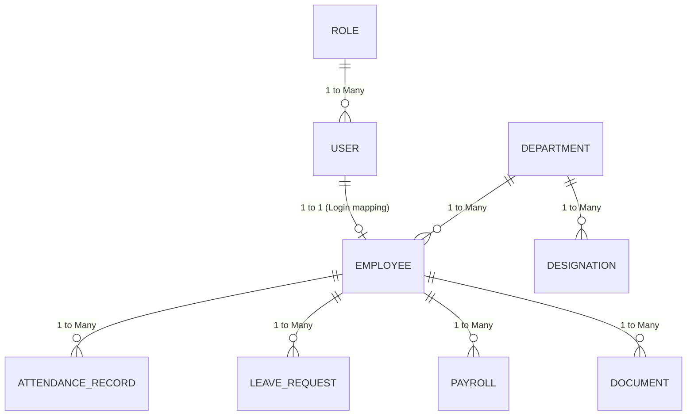

# 05 Database Architecture

## 1. Introduction
This document explains the Database Architecture, focusing on our PostgreSQL implementation and the Prisma ORM layer.

## 2. Purpose
To detail the relational structure of the core HRMS entities and explain how referential integrity and performance are maintained.

## 3. Problem it Solves
Managing a large workforce requires structured data. Storing relationships (e.g., an Employee belongs to a Department, has many Attendance Records, and reports to a Manager) in a NoSQL database can lead to data inconsistency. A relational database (RDBMS) solves this.

## 4. Why PostgreSQL + Prisma?
- **PostgreSQL:** The most advanced open-source RDBMS. Excellent for complex joins, transactions (essential for Payroll), and ACID compliance.
- **Prisma:** A modern Node.js ORM that generates fully type-safe TypeScript clients. It prevents SQL injection by default and makes schema migrations trackable in Git.

## 5. Folder Location
`docs/05_Database_Architecture.md`

## 6. Database Flow Diagram

## 7. Key Architectural Decisions

### UUIDs for Primary Keys
We use `String @id @default(uuid())` instead of auto-incrementing Integers.
- **Why?** UUIDs prevent ID guessing attacks (e.g., changing `/api/employee/1` to `/api/employee/2`). They also make database merging easier in microservice architectures.

### Referential Actions (Cascades)
Certain relations use `@relation(onDelete: Cascade)`. For example, deleting a Role deletes all RolePermissions associated with it. However, we do NOT cascade delete Employees when a Department is deleted. Instead, we use soft deletes or restrict deletion to prevent historical data loss (crucial for HR compliance).

### Separation of User and Employee
- `User` table handles system login credentials (email, password hash, RBAC roles).
- `Employee` table handles HR data (DOB, Department, Salary).
- **Why?** Security and flexibility. An external auditor might need a `User` account to log in, but they are not an `Employee`. Similarly, a past employee's `User` account can be deactivated while their `Employee` record remains for tax purposes.

## 8. Real Company Example
At enterprise companies, HR data (like Payroll and Documents) is heavily audited. By strictly separating the `User` identity from the `Employee` profile, we ensure that authentication audits (who logged in) are distinct from HR audits (when was someone hired).

## 9. Interview Questions
**Q: Why use Prisma over writing raw SQL queries?**
*Answer:* Prisma provides type-safety. If we change a column name in the database, TypeScript will throw a compile-time error wherever that column is used in our code. Raw SQL wouldn't fail until runtime, which could cause a production outage.

## 10. Manager Questions
**Q: What happens if an employee is deleted, but we need their payroll history for tax audits?**
*Answer:* In an enterprise system, we don't `DELETE FROM Employee`. We update a `status` column to `TERMINATED` or `INACTIVE` (Soft Delete). The Prisma queries in the application automatically filter out inactive employees from the active directory, but the historical payroll records remain completely intact.

## 11. Summary
The PostgreSQL database, mapped via Prisma, provides a highly relational, type-safe, and secure foundation for the HRMS, ensuring data consistency even as the platform scales.
