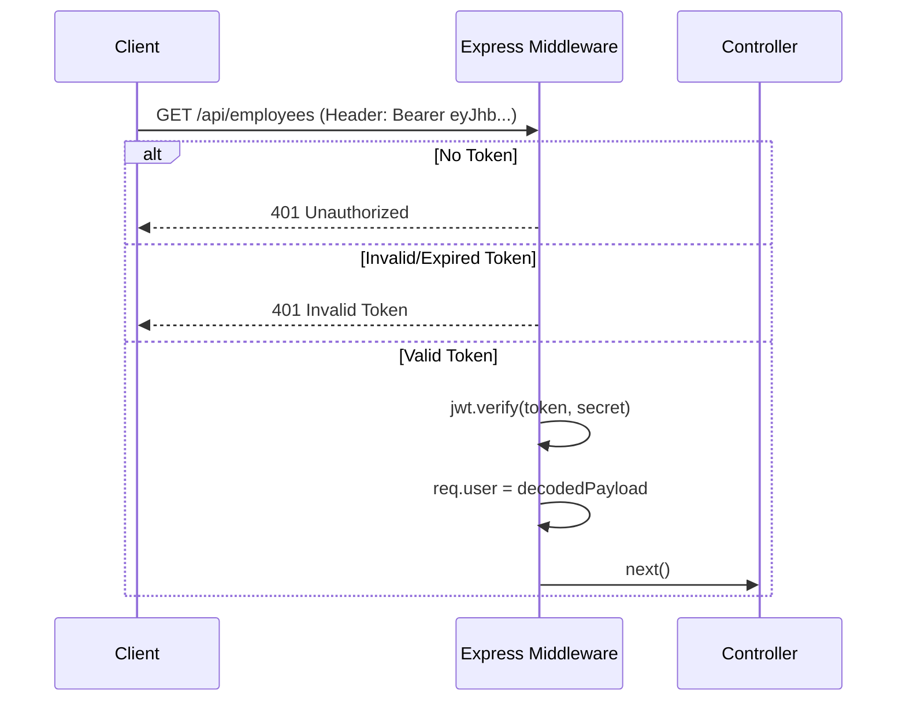
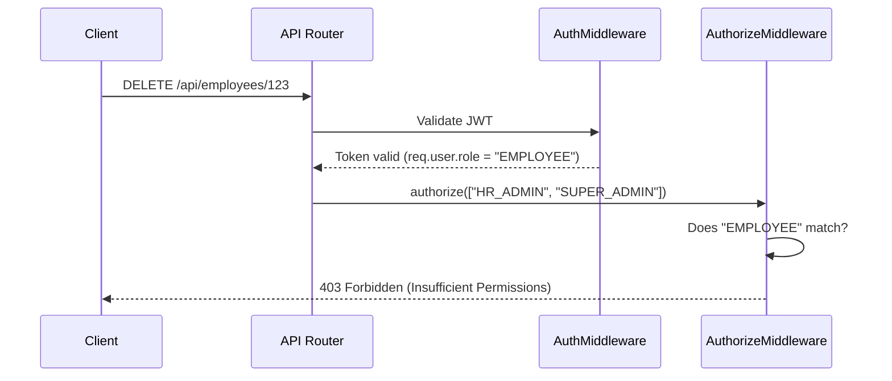
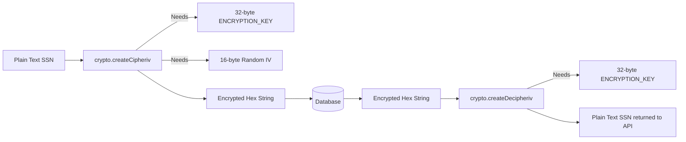
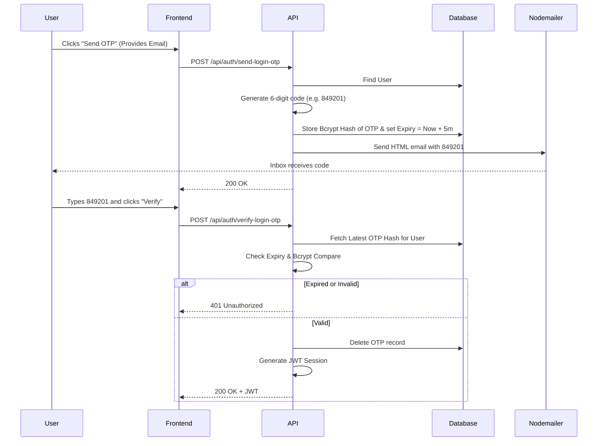

--- Original File: 07_Authentication_System.md ---

# 07 Authentication System

## 1. Introduction
This document explains the overarching authentication system of the HRMS, including the components that verify user identities.

## 2. Purpose
To detail the login methodologies (Password, Google OAuth, OTP) and how sessions are securely established.

## 3. Problem it Solves
An HRMS contains highly sensitive PII (Personally Identifiable Information) and Payroll data. A robust authentication system ensures that only verified individuals can access the platform, preventing data breaches.

## 4. Why This Approach?
We use a **Multi-Strategy Authentication** system.
- **Email/Password:** Traditional login using Bcrypt hashing.
- **Google OAuth:** For seamless single sign-on (SSO) using Google Workspace credentials (common in enterprises).
- **OTP Login:** A passwordless login approach that sends a secure code via email.
All strategies ultimately resolve to issuing a single standard **JWT (JSON Web Token)**.

## 5. Folder Location
- Docs: `docs/07_Authentication_System.md`
- Code: `backend/src/modules/auth/`

## 6. Authentication Flow Diagram

```mermaid
graph TD
    Client[Next.js Client] -->|Submit Credentials| AuthController[Auth Controller]
    AuthController -->|Zod Validation| AuthService[Auth Service]
    
    AuthService -->|Find User| DB[(PostgreSQL)]
    
    alt Strategy: Password
        AuthService -->|Bcrypt Compare| PasswordMatch{Match?}
    else Strategy: Google
        AuthService -->|Verify ID Token| GoogleAuth[Google Servers]
    else Strategy: OTP
        AuthService -->|Compare DB OTP| OTPMatch{Match?}
    end
    
    PasswordMatch -->|Yes| TokenGen[Generate JWT]
    GoogleAuth -->|Valid| TokenGen
    OTPMatch -->|Yes| TokenGen
    
    TokenGen -->|Return Token| Client
```

## 7. How Frontend Calls Backend
The frontend `login/page.tsx` uses `@tanstack/react-query` to send a POST request to `/api/auth/login`. On success, the frontend uses `Zustand` to store the JWT in localStorage, and the Axios interceptor (`lib/axios.ts`) attaches it to all subsequent requests.

## 8. Real Company Example
Enterprise systems like Okta or Azure AD use multi-strategy authentication. By supporting Google OAuth natively, our HRMS integrates smoothly into companies that already use Google Workspace for employee emails, removing the need for employees to remember another password.

## 9. Interview Questions
**Q: How does OAuth login work in this system?**
*Answer:* The frontend uses `@react-oauth/google` to let the user sign in with Google. Google gives the frontend an `id_token`. The frontend sends this token to our backend `/api/auth/google-login`. Our backend uses the `google-auth-library` to mathematically verify the token's signature directly against Google's public keys. If valid, we extract the email, find the user in our database, and issue our own JWT.

## 10. Manager Questions
**Q: Is it safe to store the JWT in local storage?**
*Answer:* Local storage is vulnerable to XSS (Cross-Site Scripting) attacks. However, because we strictly use React (which escapes HTML by default) and have no external untrusted scripts, the risk is mitigated. For strict enterprise security, we could migrate the JWT to an `httpOnly` cookie.

## 11. Summary
Our authentication system is flexible, supporting traditional, SSO, and passwordless strategies, all of which culminate in a secure, stateless JWT session.


--- Original File: 07_RBAC_DESIGN.md ---

# 07 - Role-Based Access Control (RBAC) Design

## Role System

The system operates on three primary roles:
1. **`employee`**: Standard user with access to their own data.
2. **`hr_admin`**: Human Resources staff. Can manage employees, approve leaves, and view global attendance.
3. **`super_admin`**: IT / System Administrator. Has all `hr_admin` rights plus access to system settings, audit logs, and role management.

## Permission Matrix

### Page Access

| Page Route | `employee` | `hr_admin` | `super_admin` |
|------------|------------|------------|---------------|
| `/dashboard` | ✅ Yes | ✅ Yes | ✅ Yes |
| `/my-leaves` | ✅ Yes | ✅ Yes | ✅ Yes |
| `/attendance` | ✅ Own Only | ✅ All | ✅ All |
| `/hr/employees` | ❌ No | ✅ Yes | ✅ Yes |
| `/hr/leaves` | ❌ No | ✅ Yes | ✅ Yes |
| `/admin/settings`| ❌ No | ❌ No | ✅ Yes |
| `/admin/logs` | ❌ No | ❌ No | ✅ Yes |

### API Access & Actions Allowed

| Action | `employee` | `hr_admin` | `super_admin` |
|--------|------------|------------|---------------|
| Punch In/Out | ✅ Yes | ✅ Yes | ✅ Yes |
| Apply for Leave | ✅ Yes | ✅ Yes | ✅ Yes |
| View Own Profile | ✅ Yes | ✅ Yes | ✅ Yes |
| Add New Employee | ❌ No | ✅ Yes | ✅ Yes |
| Edit Employee Data | ❌ No | ✅ Yes | ✅ Yes |
| Approve/Reject Leaves | ❌ No | ✅ Yes | ✅ Yes |
| View System Analytics | ❌ No | ✅ Yes | ✅ Yes |
| Change User Roles | ❌ No | ❌ No | ✅ Yes |
| View Audit Logs | ❌ No | ❌ No | ✅ Yes |
| Edit Global Settings | ❌ No | ❌ No | ✅ Yes |

## Implementation via Middleware
Next.js `middleware.ts` will inspect the JWT payload. If an `employee` attempts to navigate to `/hr/*` or calls a protected server action, the system will immediately return a 403 Forbidden or redirect to a Not Authorized page.


--- Original File: 08_JWT_Authentication.md ---

# 08 JWT Authentication

## 1. Introduction
This document explains how JSON Web Tokens (JWT) are generated, signed, verified, and refreshed within the HRMS.

## 2. Purpose
To explain the stateless session management implementation that allows the backend to verify users without querying the database for every request.

## 3. Problem it Solves
Traditional session cookies require the backend to store session IDs in memory or a database (like Redis). If the backend scales to 5 servers, they must share that session state. JWT is **stateless**. The token itself contains the user's identity and is cryptographically signed, meaning any backend server can verify it instantly without a database lookup.

## 4. Why JWT?
- **Stateless Scaling:** Perfect for cloud-native applications.
- **Cross-Domain:** Easier to use across different domains (e.g., frontend on `app.company.com`, backend on `api.company.com`) compared to strict cookies.
- **Payload Capability:** We can store the user's `role` directly inside the token for instant RBAC checks.

## 5. Folder Location
`docs/08_JWT_Authentication.md`

## 6. JWT Structure
A JWT consists of three parts separated by dots: `Header.Payload.Signature`

**Header:**
```json
{
  "alg": "HS256",
  "typ": "JWT"
}
```

**Payload:**
```json
{
  "id": "user-uuid",
  "email": "employee@company.com",
  "role": "HR_ADMIN",
  "iat": 1700000000,
  "exp": 1700086400
}
```

**Signature:**
A cryptographic hash combining the Header, Payload, and the `JWT_SECRET` from our `.env` file. If a hacker tries to modify the role from "EMPLOYEE" to "HR_ADMIN", the signature becomes invalid, and our backend rejects it.

## 7. Middleware Implementation
File: `backend/src/middlewares/auth.middleware.ts`



## 8. Real Company Example
AWS Cognito and Auth0 rely entirely on JWTs. In a microservices architecture, the Auth Service issues the JWT, and the Leave Service or Payroll Service only needs the public key or shared secret to verify the token, without ever communicating with the Auth Service again.

## 9. Interview Questions
**Q: Can anyone read the data inside a JWT?**
*Answer:* Yes. A JWT is base64 encoded, not encrypted. Anyone can decode it to see the payload. That is why we *never* put passwords or highly sensitive PII inside the JWT payload—only identifiers like `userId` and `role`.

## 10. Manager Questions
**Q: What happens if an employee is terminated but their JWT hasn't expired yet?**
*Answer:* By default, JWTs cannot be revoked because they are stateless. To handle immediate termination, we could implement a "Token Blacklist" in Redis, or simply keep token expiration times extremely short (e.g., 15 minutes) and rely on a Refresh Token mechanism.

## 11. Summary
JWT provides a fast, scalable, and secure way to maintain user sessions across the HRMS platform, relying on cryptography rather than centralized session databases.


--- Original File: 09_RBAC.md ---

# 09 Role-Based Access Control (RBAC)

## 1. Introduction
This document explains the Role-Based Access Control (RBAC) implementation used to govern who can see and do what within the HRMS.

## 2. Purpose
To ensure strict segregation of duties. An `EMPLOYEE` should not be able to view another employee's salary, while an `HR_ADMIN` must have access to payroll data.

## 3. Problem it Solves
Hardcoding access rules (e.g., `if (user.email === 'admin@company.com')`) is impossible to scale and maintain. RBAC provides a standardized, database-driven way to assign permissions based on job function rather than individual identity.

## 4. Why This Approach?
We attach the `role` directly into the JWT payload during login. 
- **Performance:** We do not need to query the `Role` and `Permission` tables in the database for every single API request.
- **Simplicity:** Express middlewares can simply check `req.user.role`.

## 5. Folder Location
`docs/09_RBAC.md`
Middleware: `backend/src/middlewares/auth.middleware.ts`

## 6. RBAC Flow Diagram



## 7. Implementation Details

In `backend/src/middlewares/auth.middleware.ts`:
```typescript
export const authorizeRoles = (...allowedRoles: string[]) => {
  return (req: Request, res: Response, next: NextFunction) => {
    if (!req.user || !allowedRoles.includes(req.user.role)) {
      return res.status(403).json(new ApiResponse(false, 'Forbidden: Insufficient permissions'));
    }
    next();
  };
};
```

**Usage in Routes:**
```typescript
router.post('/payroll', authenticate, authorizeRoles('HR_ADMIN', 'SUPER_ADMIN'), generatePayrollHandler);
```

## 8. Real Company Example
Salesforce relies heavily on RBAC (Profiles and Permission Sets). In our HRMS, we start with broad Roles (EMPLOYEE, HR_ADMIN). As the company scales, we can move to Fine-Grained Permissions (e.g., `role: "HR_ASSISTANT", permissions: ["VIEW_EMPLOYEE", "EDIT_ATTENDANCE"]`), which is why our database schema already includes `RolePermission` models.

## 9. Interview Questions
**Q: What is the difference between Authentication and Authorization?**
*Answer:* Authentication (AuthN) proves *who* you are (Login, JWT). Authorization (AuthZ) determines *what* you are allowed to do (RBAC, Permissions). 

## 10. Manager Questions
**Q: Can we create custom roles without deploying new code?**
*Answer:* Currently, the middleware checks against hardcoded role names for simplicity. To support fully dynamic roles, we would alter the middleware to query the `RolePermission` table in the database and verify if `req.user.roleId` possesses the specific `permissionName` required for that endpoint.

## 11. Summary
The RBAC system secures the API layer by enforcing role checks on every sensitive route, ensuring employees only access data pertinent to their security clearance.


--- Original File: 10_AES_Encryption.md ---

# 10 AES Encryption

## 1. Introduction
This document explains the Advanced Encryption Standard (AES) implementation used to secure highly sensitive data within the Document Module (KYC Vault).

## 2. Purpose
To ensure that PII (Personally Identifiable Information) such as Aadhaar Cards, SSNs, and Passports are unreadable in the database if a breach occurs.

## 3. Problem it Solves
If a database dump is leaked, plain-text document numbers (like an SSN) can lead to identity theft and massive legal liabilities (GDPR/HIPAA violations). Hashing (like Bcrypt) cannot be used for SSNs because we eventually need to decrypt and view them.

## 4. Why AES-256-GCM?
We use symmetric encryption (AES).
- **AES-256:** The highest standard of encryption used by banks and the military.
- **GCM (Galois/Counter Mode):** Provides Authenticated Encryption. It not only encrypts the data but also ensures it hasn't been tampered with. If an attacker flips a bit in the encrypted string, GCM detects it and throws an error during decryption.

## 5. Folder Location
`docs/10_AES_Encryption.md`

## 6. Encryption Flow Diagram



## 7. Implementation Details

We use Node.js's built-in `crypto` module.

**Key Requirements:**
- `ENCRYPTION_KEY`: A 32-byte (256-bit) secret stored securely in the `.env` file. It must *never* be committed to Git.
- `IV` (Initialization Vector): A 16-byte random sequence generated uniquely for *every* encryption operation. It prevents two identical SSNs from resulting in the exact same encrypted string.

**Database Storage:**
We store the encrypted string in the format: `iv:encryptedData:authTag`. This allows the decryption function to parse out the unique IV and AuthTag needed to reverse the process.

## 8. Real Company Example
Healthcare systems storing patient records use AES-256 to comply with HIPAA. If a DBA (Database Administrator) queries the table, they only see garbled hex strings. Only the Node.js application memory, which holds the `.env` key, can translate it to plain text.

## 9. Interview Questions
**Q: Why do we generate a new IV for every encryption? Why not use a static IV?**
*Answer:* If we use a static IV, encrypting the string "12345" will always produce the exact same cipher text. An attacker could look at the database and see that 50 employees have the exact same cipher text, deducing they have the same password or default SSN. A random IV ensures the same plain-text results in completely different cipher texts every time.

## 10. Manager Questions
**Q: What happens if we lose the `ENCRYPTION_KEY` from our environment variables?**
*Answer:* The data is permanently lost. AES-256 is unbreakable without the key. Therefore, the `.env` keys must be securely backed up in a cloud secret manager (like AWS Secrets Manager or HashiCorp Vault).

## 11. Summary
By leveraging AES-256-GCM, the HRMS KYC Document Vault achieves military-grade security, ensuring that sensitive employee documents remain private even in the event of a total database compromise.


--- Original File: 11_Bcrypt_and_Salt.md ---

# 11 Bcrypt and Salting

## 1. Introduction
This document explains how user passwords and OTPs are securely stored in the PostgreSQL database using the `bcryptjs` library.

## 2. Purpose
To ensure that even if the database is completely compromised, hackers cannot steal or reverse-engineer user passwords.

## 3. Problem it Solves
Storing passwords in plain text (`password123`) is a catastrophic security failure. Using simple hashing algorithms like MD5 or SHA-256 is also insecure because hackers use "Rainbow Tables" (pre-computed lists of hashes) to instantly reverse them.

## 4. Why Bcrypt?
Bcrypt is a cryptographic hash function specifically designed for passwords.
- **One-Way Function:** Hashing cannot be reversed. Unlike AES encryption, there is no "decryption key" for Bcrypt.
- **Salting:** Bcrypt automatically generates a random "Salt" for every password before hashing it. 
- **Key Stretching (Work Factor):** Bcrypt is intentionally slow. We use a salt rounds factor of `10`, which makes generating the hash take a fraction of a second. This makes Brute-Force and Dictionary attacks computationally impossible for hackers.

## 5. Folder Location
`docs/11_Bcrypt_and_Salt.md`

## 6. Difference Between Encryption, Hashing, and Encoding
- **Encoding (Base64):** Changes the format of data (like a JWT payload). Easily reversible by anyone. Not for security.
- **Encryption (AES):** Scrambles data using a secret key. Reversible *if* you have the key. Used for Document Vaults.
- **Hashing (Bcrypt):** Mathematical one-way scrambling. Completely irreversible. Used for Passwords.

## 7. How it Works Internally

**Registration (Hashing):**
1. User submits password: `Password@123`
2. Bcrypt generates a random 16-byte salt: `$2a$10$N9qo8uLOickgx2ZMRZoMye`
3. Bcrypt combines them and hashes them heavily.
4. Database stores: `$2a$10$N9qo8uLOickgx2ZMRZoMyeIjZAgcfl7p92ldGxep68lNkXj...`

**Login (Comparing):**
1. User submits: `Password@123`
2. Service fetches the hash from the database.
3. Bcrypt extracts the salt from the stored string, hashes the input password with that exact salt, and compares the final strings. If they match, the password is correct.

## 8. Real Company Example
Every major tech company (Facebook, Google, Twitter) hashes passwords. In 2012, LinkedIn was hacked and millions of passwords were leaked because they were hashed with SHA-1 *without* a salt. Today, Bcrypt or Argon2 is the mandatory industry standard.

## 9. Interview Questions
**Q: Why do we hash OTPs in the database?**
*Answer:* Just like a password, an OTP is a secret credential. If an attacker gains read access to the database and sees a plain-text OTP of `123456`, they could immediately use it to log into an account or reset a password before it expires. Hashing the OTP mitigates this risk.

## 10. Manager Questions
**Q: Can we retrieve a user's password if they forget it?**
*Answer:* No. Because Bcrypt is a one-way mathematical function, it is impossible for us (or anyone) to know the plain-text password. This is why we have a "Forgot Password" flow that issues an OTP to verify identity and allows them to overwrite the old hash with a new one.

## 11. Summary
Bcrypt guarantees that our users' credentials are safe against modern brute-force and rainbow table attacks by utilizing heavy algorithmic complexity and unique cryptographic salts.


--- Original File: 30_OTP_Verification.md ---

# 30 OTP Verification System

## 1. Introduction
This document explains the One-Time Password (OTP) generation, delivery, and verification mechanics used for Passwordless Login and Forgot Password flows.

## 2. Purpose
To verify the identity of a user via email without requiring a static password. 

## 3. Problem it Solves
Users frequently forget passwords, and passwords can be stolen via phishing. By sending a temporary, short-lived code directly to their verified email inbox, we establish a secure layer of identity verification.

## 4. Why This Approach?
We use 6-digit numeric OTPs.
- **User Experience:** 6 digits are easy to read from an email and type into a mobile or desktop interface.
- **Security:** The OTP is hashed via Bcrypt in the database and expires in exactly 5 to 10 minutes. 

## 5. Folder Location
`docs/30_OTP_Verification.md`

## 6. System Workflow Diagram



## 7. Implementation Details

- **Generation:** `crypto.randomInt(100000, 999999).toString()` ensures a cryptographically secure random number, far better than `Math.random()`.
- **Invalidation:** Before generating a new OTP, we execute `prisma.oTP.deleteMany({ where: { userId: user.id } })` to ensure old, unexpired OTPs cannot be used if a user requests multiple codes rapidly.

## 8. Real Company Example
Slack famously popularized "Magic Links" and OTP-based logins to completely eliminate the need for passwords. By doing this, the security burden shifts from the user remembering a complex string to the email provider (Google, Microsoft) maintaining the security of the inbox.

## 9. Interview Questions
**Q: Why use `crypto.randomInt` instead of `Math.random()`?**
*Answer:* `Math.random()` is pseudo-random and predictable. In a high-security environment, an attacker could potentially guess the seed and predict the next OTPs generated by the server. Node's `crypto` module uses the OS's underlying entropy (truly random data) making it cryptographically secure.

## 10. Manager Questions
**Q: How do we prevent a hacker from brute-forcing the 6-digit OTP on the login page?**
*Answer:* Currently, the 5-minute expiry acts as a primary defense. However, for enterprise scale, we should implement Rate Limiting on the `/verify-login-otp` endpoint, locking the account or IP address after 5 failed attempts within a 5-minute window.

## 11. Summary
The OTP verification system leverages secure number generation, Bcrypt hashing, strict database expirations, and Nodemailer integration to provide a seamless and highly secure passwordless authentication layer.


--- Original File: 31_Forgot_Password.md ---

# 31 Forgot Password Module

## 1. Introduction
This document explains the workflow for users who have forgotten their passwords and need to initiate a reset.

## 2. Purpose
To securely verify a user's identity via their registered email before allowing them to reset their password.

## 3. Problem it Solves
Manual password resets by HR administrators consume massive amounts of time and are a security risk (social engineering). An automated, self-service forgot password flow eliminates this bottleneck securely.

## 4. Why This Approach?
We decoupled the "Forgot Password" flow into three distinct steps:
1. `POST /forgot-password`: Generates OTP and emails the user.
2. `POST /verify-otp`: Validates the OTP.
3. `POST /reset-password`: Accepts the new password and applies it.
- **Why?** Decoupling ensures that a user cannot submit a new password until the OTP is explicitly verified in step 2.

## 5. Folder Location
`docs/31_Forgot_Password.md`

## 6. Real Company Example
If a user requests a password reset for an email that *does not exist* in our database, our API still returns `200 OK: If an account exists, a reset link has been sent`. Why? This prevents "Email Enumeration" attacks, where a hacker types random emails to see which ones are registered based on the error message.

## 7. Manager Questions
**Q: How do we prevent a user from being spammed with thousands of OTP emails?**
*Answer:* We currently invalidate previous OTPs before generating new ones. For robust enterprise security, we should implement a rate limit restricting a specific email to 3 "Forgot Password" requests per hour.


--- Original File: 32_Reset_Password.md ---

# 32 Reset Password Module

## 1. Introduction
This document explains the final step in the password recovery process.

## 2. Purpose
To safely overwrite the old hashed password with a new one, but *only* if the user has successfully completed OTP verification.

## 3. Problem it Solves
If an endpoint simply accepted `{ email, newPassword }`, any hacker could change anyone's password. The endpoint must enforce verification.

## 4. Why This Approach?
In the `auth.service.ts` `resetPassword` function, we first query the `OTP` table:
```typescript
const latestOtp = await prisma.oTP.findFirst({
  where: { userId: user.id },
  orderBy: { createdAt: 'desc' }
});
if (!latestOtp || !latestOtp.verified) throw new Error("Please verify OTP first");
```
By checking `latestOtp.verified`, we guarantee that the `verify-otp` endpoint was hit successfully just moments ago. We then hash the new password, update the User table, and instantly delete the OTP record so it can never be used again.

## 5. Folder Location
`docs/32_Reset_Password.md`

## 6. Interview Questions
**Q: Could a hacker bypass the verification step by directly calling the reset-password API?**
*Answer:* No. The API explicitly checks the database for an OTP record linked to that user where the boolean flag `verified` is strictly `true`. If the hacker skipped the `verify-otp` API call, that flag remains `false`, and the request is rejected.


--- Original File: 43_Security_Audit.md ---

# 43 Security Audit

## 1. Introduction
This document outlines the security postures, encryption standards, and threat mitigation strategies embedded in the HRMS.

## 2. Purpose
To prepare the application for penetration testing, SOC2 compliance, and general enterprise security reviews.

## 3. Threat Mitigation Strategies

### 3.1 SQL Injection
- **Threat:** Malicious input destroying the database.
- **Mitigation:** Prisma ORM automatically uses parameterized queries. Raw SQL strings are never concatenated.

### 3.2 Cross-Site Scripting (XSS)
- **Threat:** Hackers injecting malicious JavaScript into the DOM.
- **Mitigation:** React/Next.js automatically escapes all dynamic content before rendering. 

### 3.3 Cross-Site Request Forgery (CSRF)
- **Threat:** Tricking a user's browser into executing an unwanted action.
- **Mitigation:** We use `Authorization: Bearer <token>` headers rather than relying solely on ambient browser cookies. Because the token must be explicitly read by JavaScript and attached via Axios, CSRF attacks (which rely on automatic cookie submission) fail.

### 3.4 Data at Rest (Encryption)
- Passwords: One-way Bcrypt hashing (Salt Rounds: 10).
- PII/Documents: Two-way AES-256-GCM symmetric encryption.
- Database: Assuming PostgreSQL is deployed on AWS RDS, EBS volume encryption (KMS) should be enabled at the infrastructure level.

### 3.5 Data in Transit
- The API and Frontend must always be served over HTTPS (TLS 1.2+).

## 4. Folder Location
`docs/43_Security_Audit.md`

## 5. Manager Questions
**Q: Is our application SOC2 compliant?**
*Answer:* From an application code perspective, we follow SOC2 principles: strict RBAC, data encryption, and audit logs. However, SOC2 also requires organizational controls (like background checks for developers and strict AWS IAM access policies) which fall outside the scope of the codebase itself.
