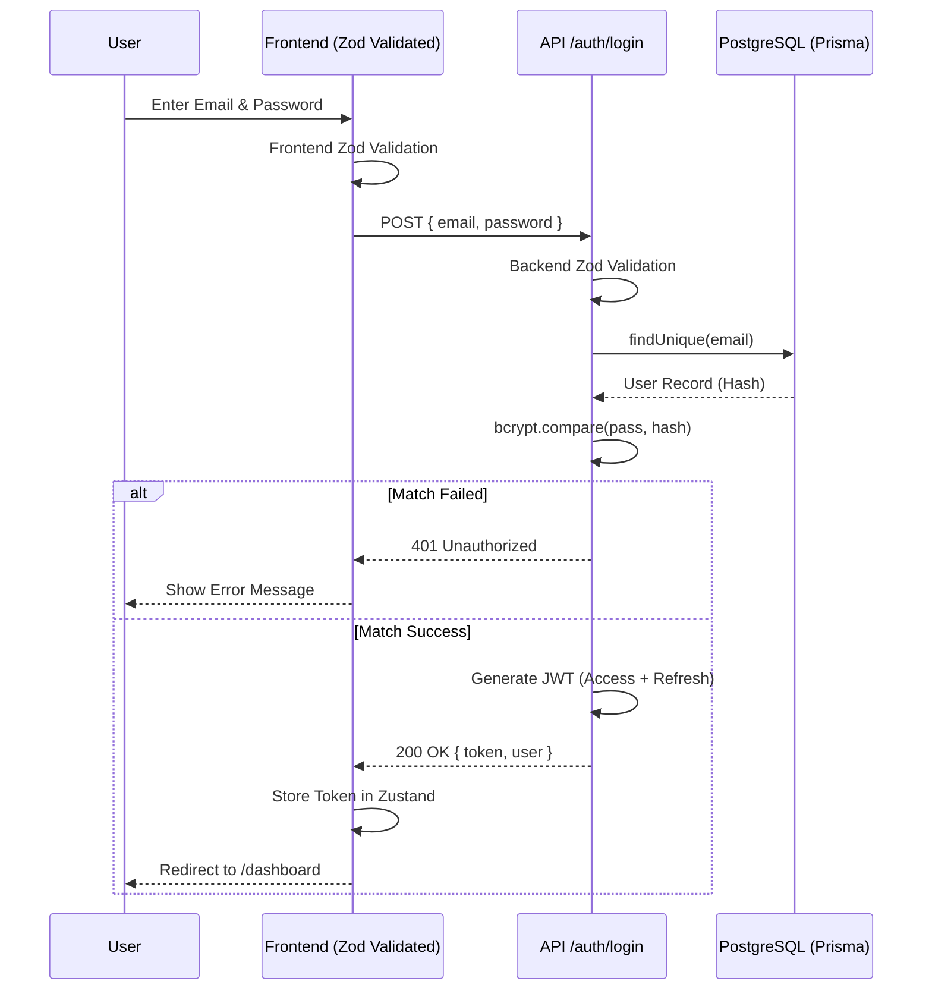

# 05. Authentication Workflow

## Business Purpose
The authentication system guarantees that only verified employees and administrators can access the Enterprise HRMS. It supports standard Email/Password login, OTP-based passwordless login, and Google OAuth SSO. Access tokens govern session lifespans, while refresh tokens provide seamless background re-authentication.

## Authentication Methods
1. **Standard Login**: Email & Password combination.
2. **OTP Login**: A 6-digit code sent via email, valid for 5 minutes.
3. **Google OAuth**: SSO using `@company.com` Google Workspaces.

## Detailed Standard Login Workflow

### 1. User Interaction (Frontend)
- The user navigates to `/login` and enters their Email and Password.
- As the user types, **Zod** schema validation running inside `react-hook-form` performs instant checks:
  - **Email**: Must be valid format (Regex), trimmed, max 255 chars.
  - **Password**: Must not be empty.

### 2. API Request
- The frontend (Axios) sends a `POST` request to `POST /api/auth/login`.

### 3. Backend Validation & Processing
- The request hits the Express route, protected by the **Rate Limiter** middleware to prevent brute force (e.g., max 5 requests per minute).
- The `validateSchema(loginSchema)` middleware executes Zod validation on the backend to ensure malicious inputs are rejected before hitting the database.
- The `auth.controller.ts` calls `auth.service.login(email, password)`.

### 4. Database Interaction (Prisma)
- Prisma executes: `prisma.user.findUnique({ where: { email }, include: { role: true } })`.
- If the user doesn't exist, an error is thrown ("Invalid credentials"). *Note: Security best practice avoids saying "Email not found" to prevent enumeration.*

### 5. Security & Password Verification
- The service uses `bcrypt.compare(password, user.passwordHash)`.
- **How bcrypt works**: The system reads the 10-round salt embedded in the stored hash, applies it to the incoming plain text password, and compares the resulting hashes. If they mismatch, the login is rejected.

### 6. JWT Generation
- Upon success, two JSON Web Tokens (JWT) are signed:
  - **Access Token**: Short-lived (e.g., 7 days or 15 minutes in production). Payload contains `{ id, email, role }`.
  - **Refresh Token**: Long-lived (e.g., 7 days). Payload contains `{ id }`.

### 7. Response & Frontend Storage
- The server responds with `200 OK` sending `{ token, refreshToken, user }`.
- The frontend stores the `token` in `Zustand` state (or `localStorage`) and the user is redirected to `/dashboard`.
- Axios interceptors are updated to automatically attach `Bearer <token>` to all subsequent requests.

## Flowchart: Complete Login Lifecycle

## OTP Passwordless Workflow
1. User requests OTP via `/api/auth/request-login-otp`.
2. Backend generates a 6-digit cryptographically random code using `crypto.randomInt()`.
3. The OTP is hashed using `bcrypt` and stored in the `OTP` table with a 5-minute expiration.
4. `Nodemailer` dispatches the raw OTP via SMTP.
5. User submits OTP to `/api/auth/verify-login-otp`.
6. Backend verifies the hash. If correct, issues JWTs identically to the standard login.

## Google SSO Workflow
1. Frontend utilizes `@react-oauth/google` to obtain a Google ID Token.
2. Token is sent to `/api/auth/google`.
3. Backend verifies token using `google-auth-library`.
4. Extracts email and verifies existence in the database. (If user doesn't exist, login is rejected - users must be invited by HR first).
5. Issues JWTs on success.

## Recommended Enterprise Workflow (For Future Implementation)
> [!TIP]
> **HttpOnly Cookies**: Currently, tokens are sent in the JSON body. In a strict enterprise environment, the Access Token and Refresh Token should be set as `HttpOnly`, `Secure`, and `SameSite=Strict` cookies to completely eliminate Cross-Site Scripting (XSS) token theft. 
> **Token Revocation**: Implement a Redis cache to store a blacklist of revoked JWTs for immediate session termination on password reset or logout.
