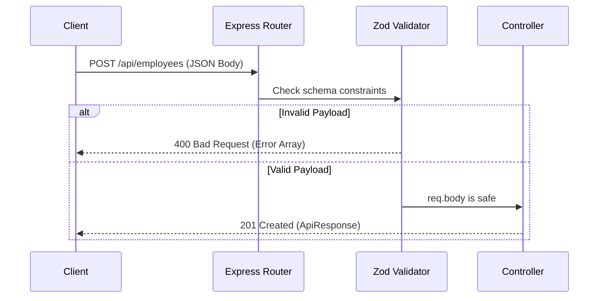

# 06 API Architecture

## 1. Introduction
This document outlines the API design principles, authentication flow, and standardized response formats used in the HRMS.

## 2. Purpose
To ensure all frontend and backend developers agree on a single contract for how APIs should look, behave, and fail.

## 3. Problem it Solves
Inconsistent APIs (e.g., one API returning `{ data: [...] }` and another returning `{ results: [...] }`) cause immense confusion and boilerplate on the frontend. A standardized API architecture prevents this.

## 4. Why REST?
We use **RESTful HTTP APIs** with JSON payloads.
- **Predictable:** Follows standard HTTP verbs (`GET` for reading, `POST` for creating, `PUT`/`PATCH` for updating, `DELETE` for removing).
- **Stateless:** Every request contains all the information needed (via the JWT in the Authorization header) to authenticate and process it.

## 5. Folder Location
`docs/06_API_Architecture.md`

## 6. Standardized Response Format
We use a unified `ApiResponse` class in the backend.

**Success Response (2xx):**
```json
{
  "success": true,
  "message": "Operation successful",
  "data": {
    "id": "123",
    "name": "John Doe"
  }
}
```

**Error Response (4xx/5xx):**
```json
{
  "success": false,
  "message": "Validation Error",
  "data": [
    { "field": "email", "message": "Invalid email format" }
  ]
}
```

## 7. API Flow Diagram



## 8. API Documentation (Swagger/OpenAPI)
All APIs are documented using Swagger.
- **Location:** `backend/src/docs/swagger.ts`
- **Usage:** Developers write JSDoc comments above the route definitions in `*.route.ts`. The Swagger UI is exposed at `/api-docs` when running the server in development.

## 9. Real Company Example
Public APIs from Stripe or Twilio are beloved by developers because of their absolute consistency. By enforcing the `ApiResponse` class, our internal HRMS APIs achieve that same level of consistency, meaning the frontend developer never has to guess the shape of the response.

## 10. Interview Questions
**Q: What is the difference between PUT and PATCH?**
*Answer:* `PUT` replaces the entire resource. If you send an object with just one updated field to a PUT endpoint, the other fields might be set to null. `PATCH` applies partial updates, only modifying the fields explicitly provided in the payload.

## 11. Manager Questions
**Q: How do we prevent third parties from scraping our employee directory API?**
*Answer:* We implement JWT Authentication on the route. Furthermore, we can implement Rate Limiting (e.g., using `express-rate-limit`) to restrict an IP address to 100 requests per minute, preventing automated scraping.

## 12. Summary
A predictable, documented, and secure RESTful API architecture serves as the robust communication bridge between the Next.js frontend and the PostgreSQL database.
