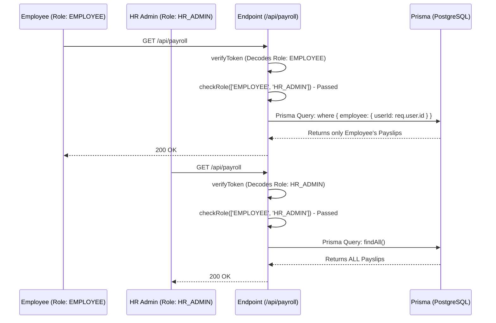

# 06. Authorization & RBAC

## Business Purpose
Authorization ensures that an authenticated user can only access the data and perform actions they are strictly permitted to do. The Enterprise HRMS uses a **Role-Based Access Control (RBAC)** model layered with dynamic permission mapping.

## RBAC Model Breakdown

### Core Entities (Prisma schema)
- `User`: Has a `roleId` pointing to a specific `Role`.
- `Role`: Broad categorizations of users. Default roles include:
  - **SUPER_ADMIN**: Full system access (Tenant Owner).
  - **HR_ADMIN**: Can manage Employees, Payroll, and Organizational structures.
  - **MANAGER**: Can view team attendance and approve subordinate leave requests.
  - **EMPLOYEE**: Restricted to their own self-service portal (Payslips, My Attendance, Profile).
- `Permission`: Specific granular actions (e.g., `READ_PAYROLL`, `APPROVE_LEAVE`, `DELETE_EMPLOYEE`).
- `RolePermission`: The junction table linking specific permissions to a role.

## Authorization Flow

### 1. Token Extraction (Middleware)
When an API request arrives at a protected endpoint, the `verifyToken` middleware:
1. Extracts the Bearer token from the `Authorization` header.
2. Verifies the token cryptographically using `JWT_SECRET`.
3. Decodes the payload which contains `{ id, email, role }`.
4. Attaches the decoded payload to the Express `req` object as `req.user`.

### 2. Role Verification (Middleware)
Endpoints use the `checkRole` middleware to restrict access.
Example Route: 
`router.delete('/employees/:id', verifyToken, checkRole(['SUPER_ADMIN', 'HR_ADMIN']), deleteEmployee);`

**Execution Flow**:
1. `checkRole` reads `req.user.role`.
2. It checks if the role exists in the allowed array.
3. If not, it throws a `403 Forbidden` error (Access Denied).

## Hierarchical & Data-Level Authorization

Role-based access is often insufficient. E.g., A `MANAGER` has permission to view employee profiles, but they should only be allowed to view profiles of their *subordinates*, not the CEO's profile.

### Service-Layer Implementation
Data-level authorization is enforced inside the business logic services.
For example, in `employee.service.ts` or `attendance.service.ts`:
1. The service receives the `req.user.id`.
2. If `role === 'EMPLOYEE'`, the Prisma query restricts results: `where: { userId: req.user.id }`.
3. If `role === 'MANAGER'`, the service first looks up the Manager's `Employee` record, then queries: `where: { managerId: manager.id }`.
4. If `role === 'HR_ADMIN'`, the query drops the filter and fetches all records.

## Sequence Diagram: Resource Access

## Recommended Enterprise Workflow (Dynamic RBAC)
Currently, authorization relies heavily on hardcoded string matching via `checkRole(['ROLE_NAME'])`. 
For maximum enterprise flexibility:
1. Implement a `checkPermission('DELETE_EMPLOYEE')` middleware.
2. The middleware fetches the user's mapped `Permissions` from the `RolePermission` table in the database and caches them in Redis.
3. This allows Super Admins to dynamically create custom roles (e.g., "Junior HR") and assign granular permissions from the UI without requiring code deployments.
