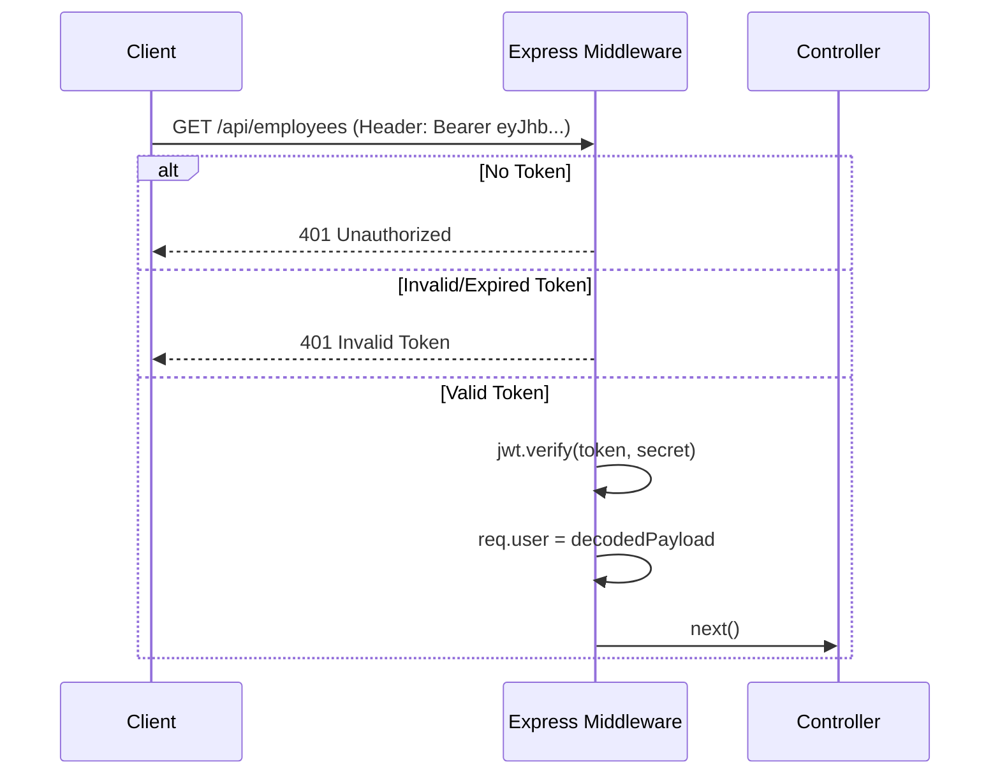

# 08 JWT Authentication

## 1. Introduction
This document explains how JSON Web Tokens (JWT) are generated, signed, verified, and refreshed within the HRMS.

## 2. Purpose
To explain the stateless session management implementation that allows the backend to verify users without querying the database for every request.

## 3. Problem it Solves
Traditional session cookies require the backend to store session IDs in memory or a database (like Redis). If the backend scales to 5 servers, they must share that session state. JWT is **stateless**. The token itself contains the user's identity and is cryptographically signed, meaning any backend server can verify it instantly without a database lookup.

## 4. Why JWT?
- **Stateless Scaling:** Perfect for cloud-native applications.
- **Cross-Domain:** Easier to use across different domains (e.g., frontend on `app.company.com`, backend on `api.company.com`) compared to strict cookies.
- **Payload Capability:** We can store the user's `role` directly inside the token for instant RBAC checks.

## 5. Folder Location
`docs/08_JWT_Authentication.md`

## 6. JWT Structure
A JWT consists of three parts separated by dots: `Header.Payload.Signature`

**Header:**
```json
{
  "alg": "HS256",
  "typ": "JWT"
}
```

**Payload:**
```json
{
  "id": "user-uuid",
  "email": "employee@company.com",
  "role": "HR_ADMIN",
  "iat": 1700000000,
  "exp": 1700086400
}
```

**Signature:**
A cryptographic hash combining the Header, Payload, and the `JWT_SECRET` from our `.env` file. If a hacker tries to modify the role from "EMPLOYEE" to "HR_ADMIN", the signature becomes invalid, and our backend rejects it.

## 7. Middleware Implementation
File: `backend/src/middlewares/auth.middleware.ts`



## 8. Real Company Example
AWS Cognito and Auth0 rely entirely on JWTs. In a microservices architecture, the Auth Service issues the JWT, and the Leave Service or Payroll Service only needs the public key or shared secret to verify the token, without ever communicating with the Auth Service again.

## 9. Interview Questions
**Q: Can anyone read the data inside a JWT?**
*Answer:* Yes. A JWT is base64 encoded, not encrypted. Anyone can decode it to see the payload. That is why we *never* put passwords or highly sensitive PII inside the JWT payload—only identifiers like `userId` and `role`.

## 10. Manager Questions
**Q: What happens if an employee is terminated but their JWT hasn't expired yet?**
*Answer:* By default, JWTs cannot be revoked because they are stateless. To handle immediate termination, we could implement a "Token Blacklist" in Redis, or simply keep token expiration times extremely short (e.g., 15 minutes) and rely on a Refresh Token mechanism.

## 11. Summary
JWT provides a fast, scalable, and secure way to maintain user sessions across the HRMS platform, relying on cryptography rather than centralized session databases.
