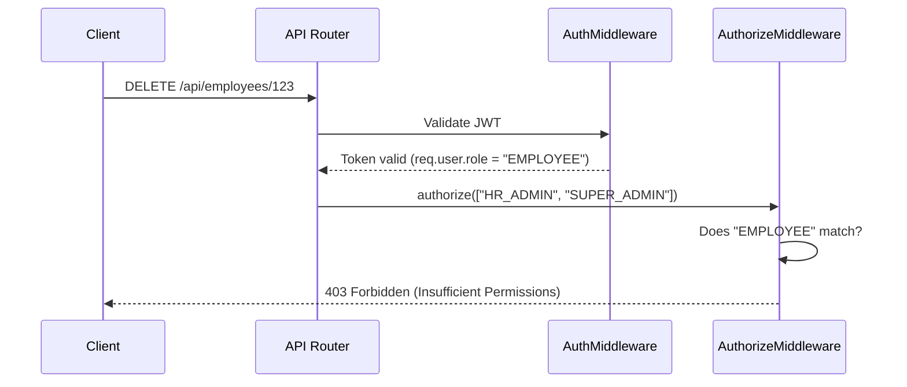

# 09 Role-Based Access Control (RBAC)

## 1. Introduction
This document explains the Role-Based Access Control (RBAC) implementation used to govern who can see and do what within the HRMS.

## 2. Purpose
To ensure strict segregation of duties. An `EMPLOYEE` should not be able to view another employee's salary, while an `HR_ADMIN` must have access to payroll data.

## 3. Problem it Solves
Hardcoding access rules (e.g., `if (user.email === 'admin@company.com')`) is impossible to scale and maintain. RBAC provides a standardized, database-driven way to assign permissions based on job function rather than individual identity.

## 4. Why This Approach?
We attach the `role` directly into the JWT payload during login. 
- **Performance:** We do not need to query the `Role` and `Permission` tables in the database for every single API request.
- **Simplicity:** Express middlewares can simply check `req.user.role`.

## 5. Folder Location
`docs/09_RBAC.md`
Middleware: `backend/src/middlewares/auth.middleware.ts`

## 6. RBAC Flow Diagram



## 7. Implementation Details

In `backend/src/middlewares/auth.middleware.ts`:
```typescript
export const authorizeRoles = (...allowedRoles: string[]) => {
  return (req: Request, res: Response, next: NextFunction) => {
    if (!req.user || !allowedRoles.includes(req.user.role)) {
      return res.status(403).json(new ApiResponse(false, 'Forbidden: Insufficient permissions'));
    }
    next();
  };
};
```

**Usage in Routes:**
```typescript
router.post('/payroll', authenticate, authorizeRoles('HR_ADMIN', 'SUPER_ADMIN'), generatePayrollHandler);
```

## 8. Real Company Example
Salesforce relies heavily on RBAC (Profiles and Permission Sets). In our HRMS, we start with broad Roles (EMPLOYEE, HR_ADMIN). As the company scales, we can move to Fine-Grained Permissions (e.g., `role: "HR_ASSISTANT", permissions: ["VIEW_EMPLOYEE", "EDIT_ATTENDANCE"]`), which is why our database schema already includes `RolePermission` models.

## 9. Interview Questions
**Q: What is the difference between Authentication and Authorization?**
*Answer:* Authentication (AuthN) proves *who* you are (Login, JWT). Authorization (AuthZ) determines *what* you are allowed to do (RBAC, Permissions). 

## 10. Manager Questions
**Q: Can we create custom roles without deploying new code?**
*Answer:* Currently, the middleware checks against hardcoded role names for simplicity. To support fully dynamic roles, we would alter the middleware to query the `RolePermission` table in the database and verify if `req.user.roleId` possesses the specific `permissionName` required for that endpoint.

## 11. Summary
The RBAC system secures the API layer by enforcing role checks on every sensitive route, ensuring employees only access data pertinent to their security clearance.
