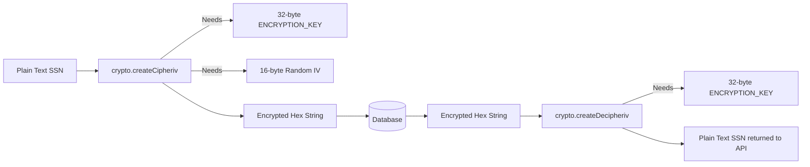

# 10 AES Encryption

## 1. Introduction
This document explains the Advanced Encryption Standard (AES) implementation used to secure highly sensitive data within the Document Module (KYC Vault).

## 2. Purpose
To ensure that PII (Personally Identifiable Information) such as Aadhaar Cards, SSNs, and Passports are unreadable in the database if a breach occurs.

## 3. Problem it Solves
If a database dump is leaked, plain-text document numbers (like an SSN) can lead to identity theft and massive legal liabilities (GDPR/HIPAA violations). Hashing (like Bcrypt) cannot be used for SSNs because we eventually need to decrypt and view them.

## 4. Why AES-256-GCM?
We use symmetric encryption (AES).
- **AES-256:** The highest standard of encryption used by banks and the military.
- **GCM (Galois/Counter Mode):** Provides Authenticated Encryption. It not only encrypts the data but also ensures it hasn't been tampered with. If an attacker flips a bit in the encrypted string, GCM detects it and throws an error during decryption.

## 5. Folder Location
`docs/10_AES_Encryption.md`

## 6. Encryption Flow Diagram

## 7. Implementation Details

We use Node.js's built-in `crypto` module.

**Key Requirements:**
- `ENCRYPTION_KEY`: A 32-byte (256-bit) secret stored securely in the `.env` file. It must *never* be committed to Git.
- `IV` (Initialization Vector): A 16-byte random sequence generated uniquely for *every* encryption operation. It prevents two identical SSNs from resulting in the exact same encrypted string.

**Database Storage:**
We store the encrypted string in the format: `iv:encryptedData:authTag`. This allows the decryption function to parse out the unique IV and AuthTag needed to reverse the process.

## 8. Real Company Example
Healthcare systems storing patient records use AES-256 to comply with HIPAA. If a DBA (Database Administrator) queries the table, they only see garbled hex strings. Only the Node.js application memory, which holds the `.env` key, can translate it to plain text.

## 9. Interview Questions
**Q: Why do we generate a new IV for every encryption? Why not use a static IV?**
*Answer:* If we use a static IV, encrypting the string "12345" will always produce the exact same cipher text. An attacker could look at the database and see that 50 employees have the exact same cipher text, deducing they have the same password or default SSN. A random IV ensures the same plain-text results in completely different cipher texts every time.

## 10. Manager Questions
**Q: What happens if we lose the `ENCRYPTION_KEY` from our environment variables?**
*Answer:* The data is permanently lost. AES-256 is unbreakable without the key. Therefore, the `.env` keys must be securely backed up in a cloud secret manager (like AWS Secrets Manager or HashiCorp Vault).

## 11. Summary
By leveraging AES-256-GCM, the HRMS KYC Document Vault achieves military-grade security, ensuring that sensitive employee documents remain private even in the event of a total database compromise.
