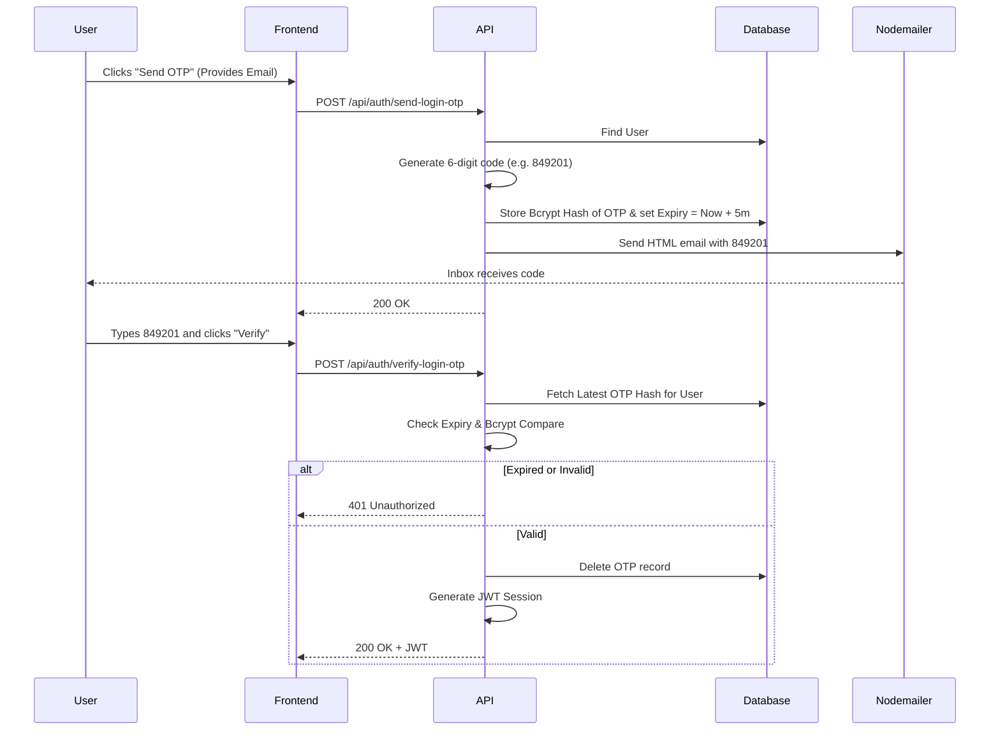

# 30 OTP Verification System

## 1. Introduction
This document explains the One-Time Password (OTP) generation, delivery, and verification mechanics used for Passwordless Login and Forgot Password flows.

## 2. Purpose
To verify the identity of a user via email without requiring a static password. 

## 3. Problem it Solves
Users frequently forget passwords, and passwords can be stolen via phishing. By sending a temporary, short-lived code directly to their verified email inbox, we establish a secure layer of identity verification.

## 4. Why This Approach?
We use 6-digit numeric OTPs.
- **User Experience:** 6 digits are easy to read from an email and type into a mobile or desktop interface.
- **Security:** The OTP is hashed via Bcrypt in the database and expires in exactly 5 to 10 minutes. 

## 5. Folder Location
`docs/30_OTP_Verification.md`

## 6. System Workflow Diagram

## 7. Implementation Details

- **Generation:** `crypto.randomInt(100000, 999999).toString()` ensures a cryptographically secure random number, far better than `Math.random()`.
- **Invalidation:** Before generating a new OTP, we execute `prisma.oTP.deleteMany({ where: { userId: user.id } })` to ensure old, unexpired OTPs cannot be used if a user requests multiple codes rapidly.

## 8. Real Company Example
Slack famously popularized "Magic Links" and OTP-based logins to completely eliminate the need for passwords. By doing this, the security burden shifts from the user remembering a complex string to the email provider (Google, Microsoft) maintaining the security of the inbox.

## 9. Interview Questions
**Q: Why use `crypto.randomInt` instead of `Math.random()`?**
*Answer:* `Math.random()` is pseudo-random and predictable. In a high-security environment, an attacker could potentially guess the seed and predict the next OTPs generated by the server. Node's `crypto` module uses the OS's underlying entropy (truly random data) making it cryptographically secure.

## 10. Manager Questions
**Q: How do we prevent a hacker from brute-forcing the 6-digit OTP on the login page?**
*Answer:* Currently, the 5-minute expiry acts as a primary defense. However, for enterprise scale, we should implement Rate Limiting on the `/verify-login-otp` endpoint, locking the account or IP address after 5 failed attempts within a 5-minute window.

## 11. Summary
The OTP verification system leverages secure number generation, Bcrypt hashing, strict database expirations, and Nodemailer integration to provide a seamless and highly secure passwordless authentication layer.
